<div align="center">

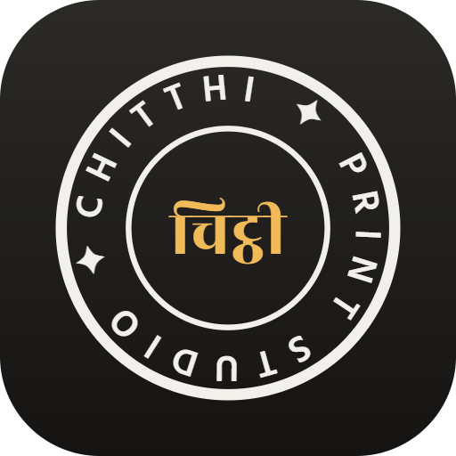

# Chitthi Studio

**Your photos, made into postcards, calendars and prints, Instagram posts, Reels and YouTube videos.**

Indian festival, birthday and season themes · print-ready PDFs with bleed and crop marks · a photo editor with curves,
masks (AI too), presets and RAW · a video editor for Reels and vlogs · runs entirely on your device, in the browser or
as a desktop app

[](https://github.com/RVicky172/Chitthi/releases)
[](LICENSE)


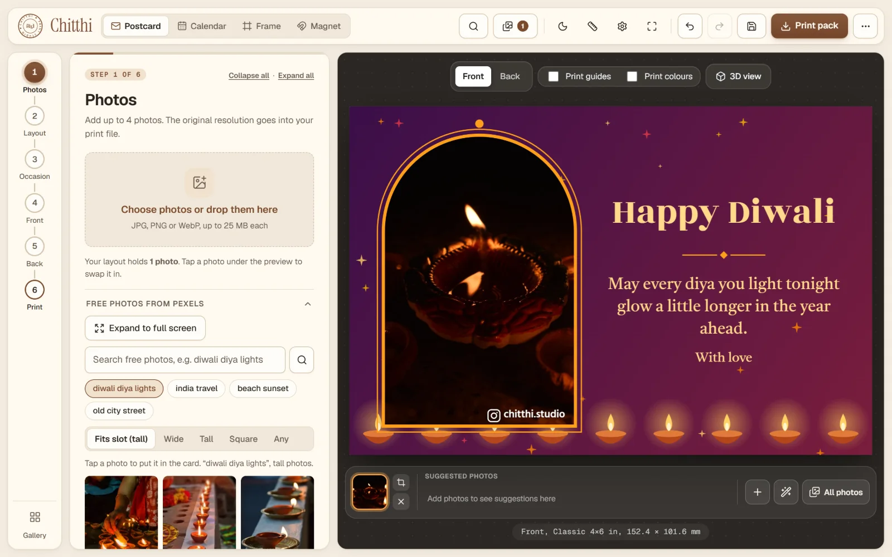

</div>

## Contents

[What it does](#what-it-does) · [Highlights](#highlights) · [Screenshots](#screenshots) · [Get started](#get-started) ·
[Use cases](#use-cases) ·
[Print studio](#print-studio) · [Photo & video studio](#photo--video-studio) · [AI writing and pictures](#ai-writing-and-pictures) ·
[AI agents (MCP)](#ai-agents-mcp) · [Performance monitor](#performance-monitor) · [Keyboard shortcuts](#keyboard-shortcuts) ·
[Web or desktop](#web-or-desktop) · [Requirements](#requirements) · [Privacy and security](#privacy-and-security) ·
[Accessibility](#accessibility) · [Documentation](#documentation) · [Development](#development) · [Roadmap](#roadmap) ·
[Contributing](#contributing) · [License](#license)

## What it does

Chitthi Studio is free and open source: two studios in one app, with no account, no server, no subscription and no
paid tier.

| Studio | Makes | You get |
| --- | --- | --- |
| **Print studio** | Postcards, calendars, framed prints, fridge magnets, matching envelopes | Print-shop PDFs with bleed and crop marks, 300 dpi PNGs, a print pack ZIP with specs and a quote request |
| **Photo & video studio** | Instagram photos and carousels, Reels and Shorts, YouTube videos | 1080 px JPEG, PNG, WebP, AVIF or 16-bit TIFF files or a ZIP; H.264 + AAC MP4 videos with fast start, up to 4K60 in the desktop app |

<p align="center">
  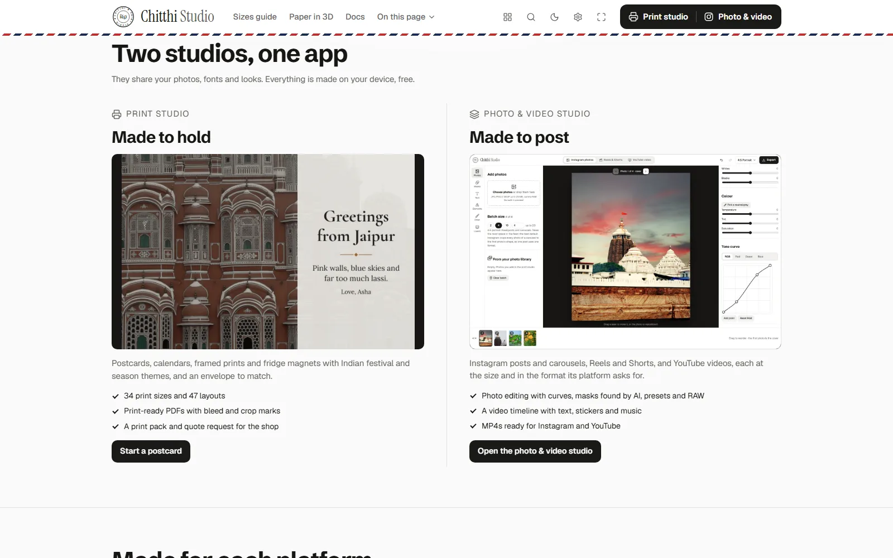
</p>

It runs as a web app (installable, works offline) and as a desktop app for Windows and macOS. Version 2.8.0, with the
advanced photo editor (2.10.0) in the [CHANGELOG](CHANGELOG.md)'s Unreleased section. The app has its own
documentation too: **Docs** in the site menu (`#/docs`), for using it and for developers.

## Highlights

- **Four print products, 34 sizes, 47 layouts.** Postcards (4×6 in, A6, India Post, Instax…), wall and desk
  calendars for any year, framed prints with a mat, and fridge magnets, square, rounded or round.
- **Made for India.** 25 occasions (15 festivals, 5 birthday styles, 5 seasons) with drawn artwork and wishes in
  English, Hindi, Hinglish and regional scripts; 46 fonts covering Devanagari, Gurmukhi, Gujarati, Bengali, Tamil,
  Malayalam, Kannada, Telugu and Odia; calendars mark national days and festivals from the Government of India holiday
  lists.
- **Print-shop ready.** One click makes a ZIP with the print PDF (bleed and crop marks), sheet PDFs, 300 dpi PNGs, a
  print spec, a quote request and a matching envelope with a fold-your-own template.
- **Smart photos.** Every photo is analysed for shape, colour, light and sharpness; the library ranks photos for
  each slot, auto-arranges them and centres crops on the subject. Free Pexels photos come with their credits.
- **See it before you print.** 3D preview of every design and envelope, a print-colours soft proof, and a page with
  every paper size in 3D at true scale.
- **An advanced photo editor.** Exposure, highlights, shadows and white balance in linear light; tone curves, a colour
  mixer, sharpening, noise reduction, clarity and dehaze; presets and 3D LUTs; masks painted, drawn as gradients, picked
  by colour or brightness, or **found by AI on your device** (subject, background, sky). All on the graphics card.
- **RAW and 16 bits.** Camera RAW files developed by LibRaw in the desktop app, exported as 16-bit TIFFs that keep
  their precision through every edit.
- **Instagram, Reels and YouTube.** Batch up to 20 photos with text, shapes, stickers, drawings and image layers with
  blend modes; edit Reels, Shorts and vlogs on a timeline with music, and export MP4 files made on your device.
- **Optional AI, your own key.** Greetings, calendar captions and slot-shaped artwork from Claude, OpenAI, Gemini,
  a local Ollama and 12 more services, in 12 languages.
- **Works with AI agents.** The desktop app is an MCP server with 56 tools for print designs and photo editing; a
  Claude Code plugin adds six workflow skills.
- **Private by design.** No account and no server: photos, designs and keys never leave the device.

## Screenshots

<table>
  <tr>
    <td width="50%">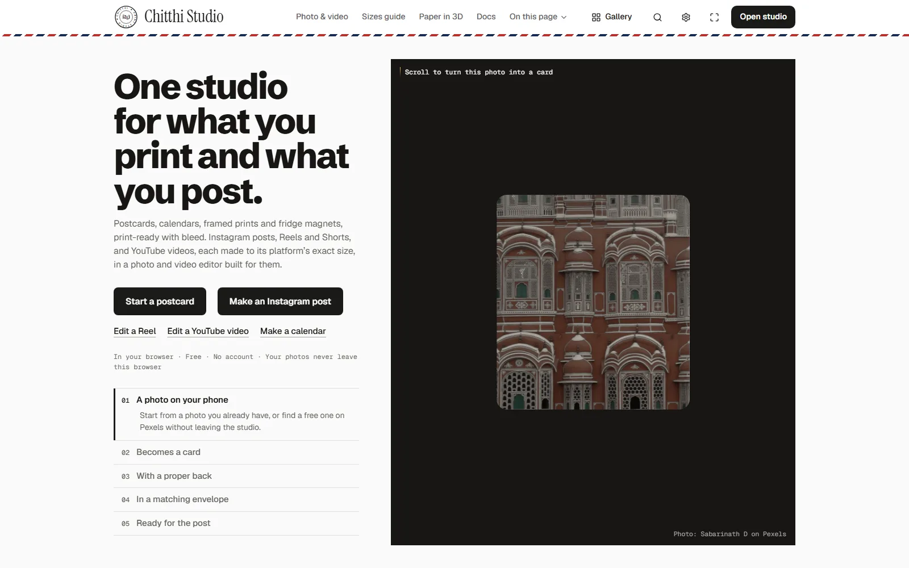<br /><sub><b>Home</b>: one studio for print and for every platform</sub></td>
    <td width="50%">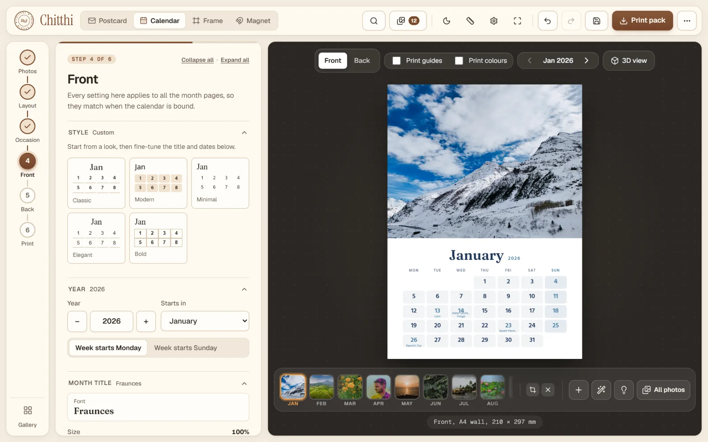<br /><sub><b>Calendars</b>: five styles, any year, festivals marked by name</sub></td>
  </tr>
  <tr>
    <td>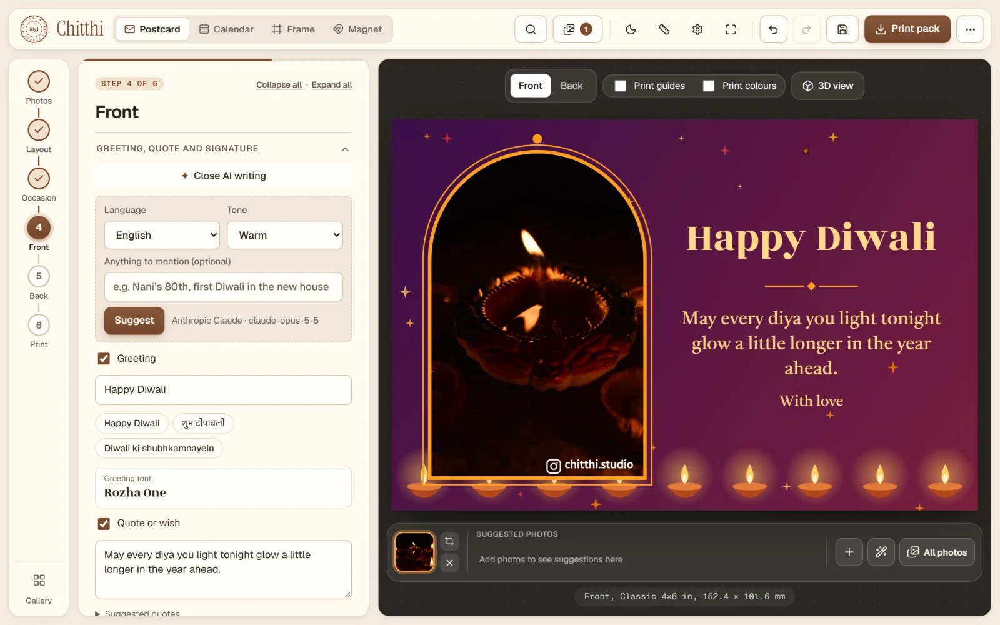<br /><sub><b>Write with AI</b>: greetings sized to the layout, in your language</sub></td>
    <td>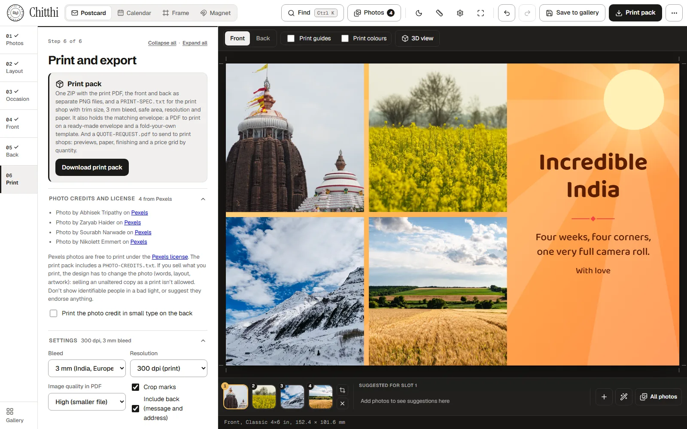<br /><sub><b>Print</b>: one print pack with bleed, credits and a quote request</sub></td>
  </tr>
  <tr>
    <td>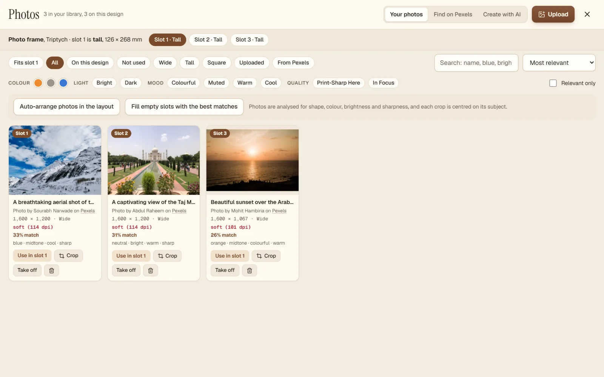<br /><sub><b>Photo library</b>: ranked for each slot, with print sharpness</sub></td>
    <td>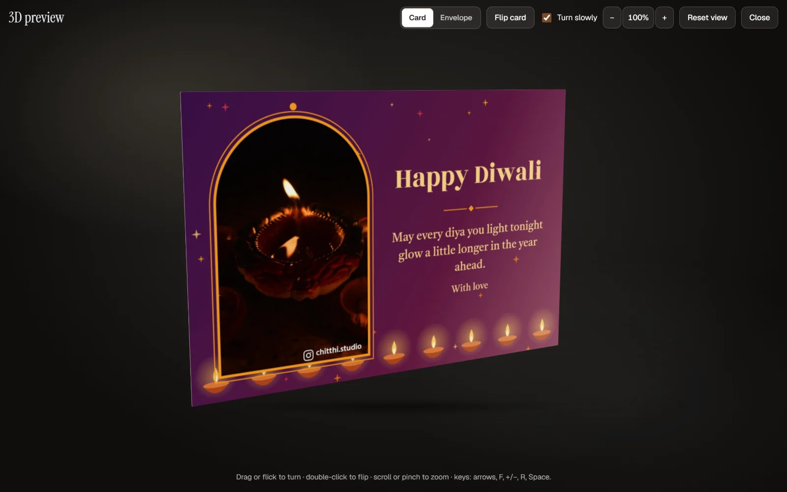<br /><sub><b>3D preview</b>: turn, flip and zoom any design or its envelope</sub></td>
  </tr>
  <tr>
    <td>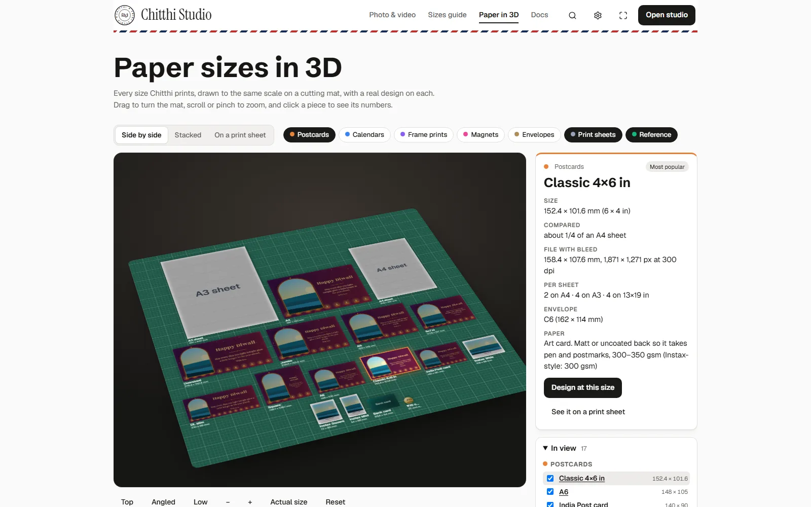<br /><sub><b>Paper sizes in 3D</b>: every size at true relative scale</sub></td>
    <td>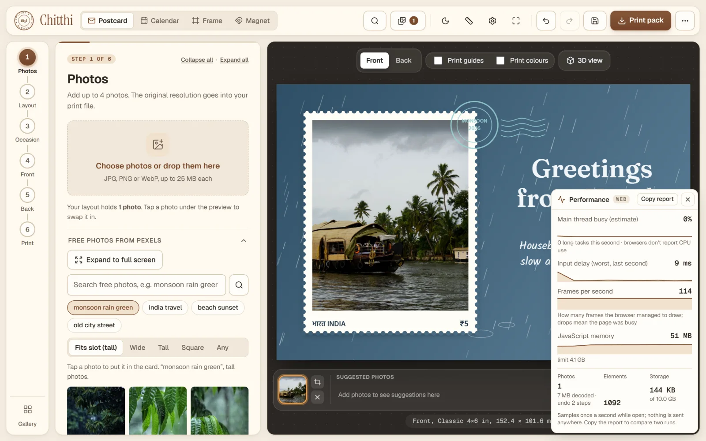<br /><sub><b>Performance monitor</b>: CPU, memory and responsiveness, live</sub></td>
  </tr>
  <tr>
    <td>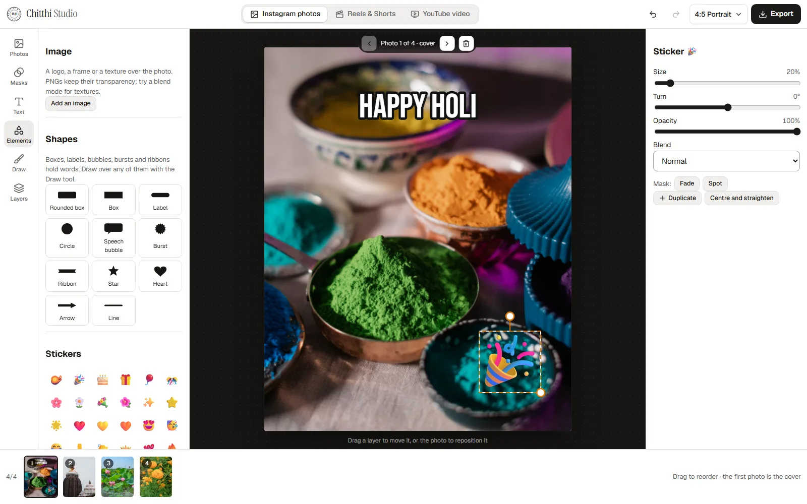<br /><sub><b>Instagram photos</b>: a batch of up to 20 with text, shapes, stickers, drawings and images</sub></td>
    <td>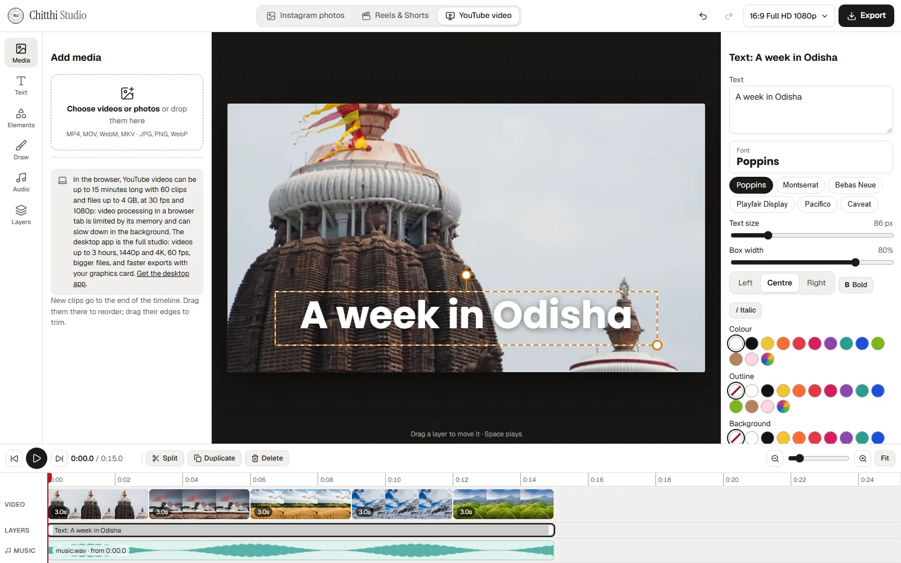<br /><sub><b>YouTube video</b>: clips, timed text and music on a timeline, exported as MP4</sub></td>
  </tr>
  <tr>
    <td>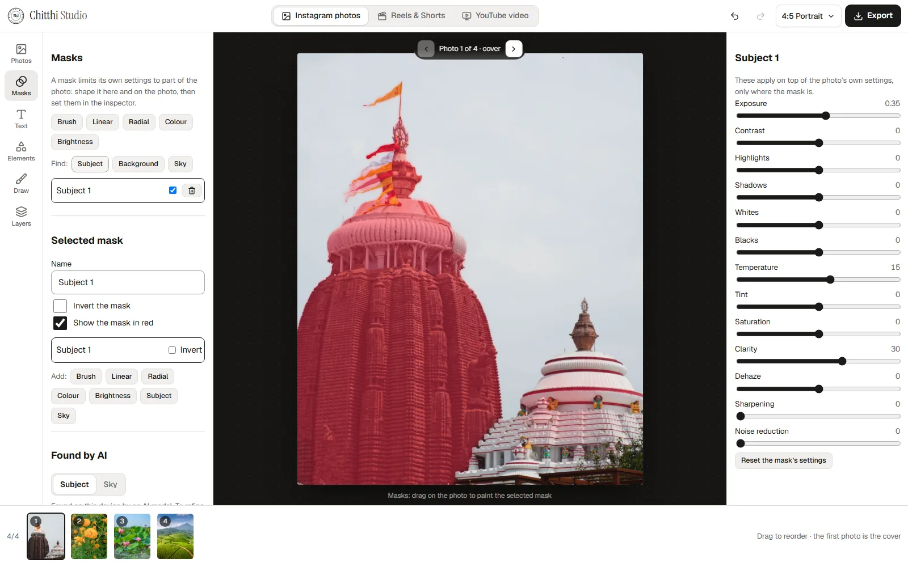<br /><sub><b>AI masks</b>: the subject, background or sky, found on your device</sub></td>
    <td>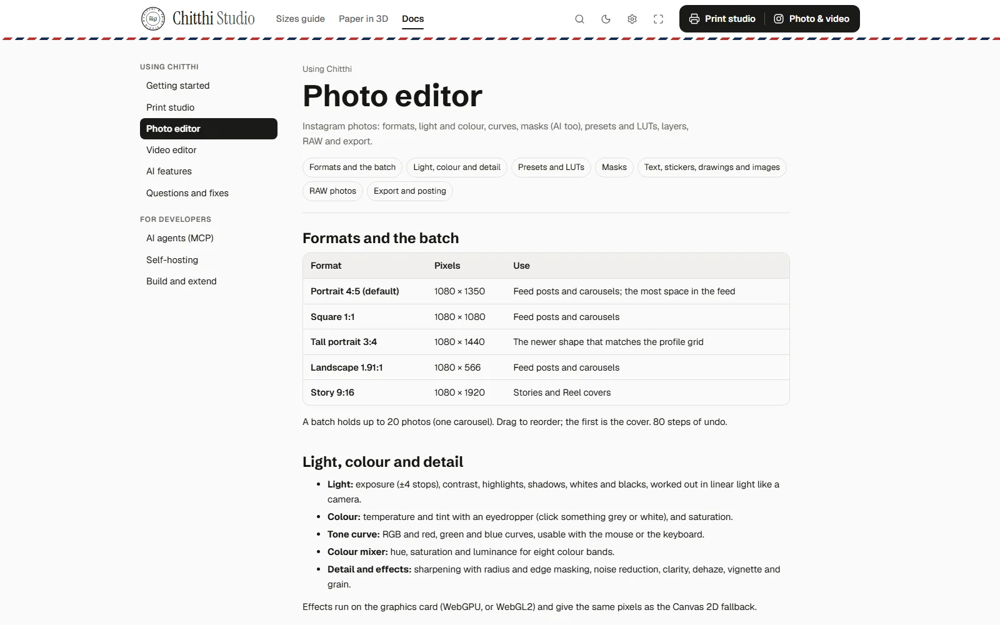<br /><sub><b>Documentation</b>: in the app, for using it and for developers</sub></td>
  </tr>
</table>

<p align="center">
  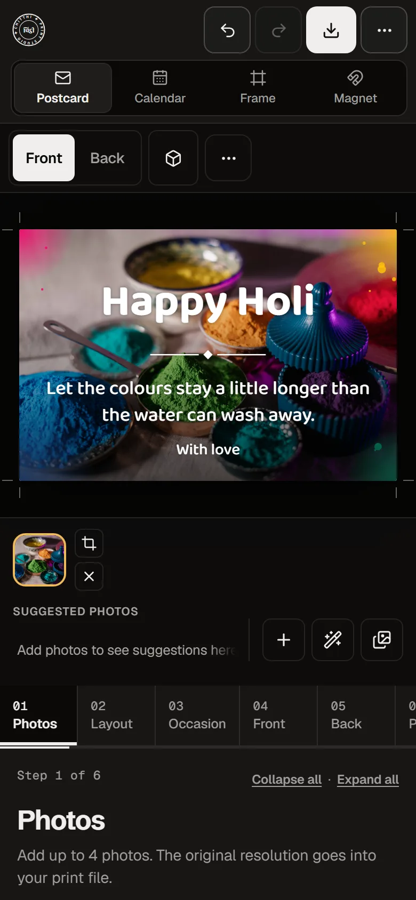<br />
  <sub><b>On a phone, in the dark theme</b>: the whole studio from 360 px wide, with secondary actions in a More menu</sub>
</p>

## Get started

**Use it:**

- **Desktop app** (Windows x64; macOS on Intel and Apple silicon): download the installer from
  [GitHub Releases](https://github.com/RVicky172/Chitthi/releases). It works offline, updates itself, runs the full
  video studio, and adds real CPU and memory figures and the MCP server for AI agents. If Windows shows "Windows
  protected your PC", the build isn't code-signed yet: check it came from the releases page, then **More info → Run
  anyway** ([TROUBLESHOOTING](docs/TROUBLESHOOTING.md)).
- **Web app:** deploy the Docker image (below) or run it from source. In Chrome or Edge it can be installed from the
  address bar and works offline after the first visit.

**Run it from source** (Node.js 20.19+ or 22.12+):

```bash
npm install
npm run dev              # web app at http://localhost:5173
npm run fetch:fonts      # once, for the desktop app: offline fonts
npm run fetch:libraw     # once, for the desktop app: LibRaw for RAW photos
npm run desktop:dev      # desktop app with hot reload
```

**Deploy the web app** (nginx, non-root, read-only file system):

```bash
docker compose up -d --build     # http://localhost:8080, health check at /healthz
```

Put it behind an HTTPS reverse proxy: the service worker (offline use) needs HTTPS. Bump `APP_CACHE` in
`public/sw.js` with each release so returning visitors get the new version. Production setup, headers, upgrades and
rollback: [docs/OPERATIONS.md](docs/OPERATIONS.md); every script and the release process: [specs/build.md](specs/build.md).

**Free photo search** needs a free [Pexels](https://www.pexels.com/api/) API key, entered in **Settings** and kept on
the device only. For development, put `PEXELS_API_KEY=…` in `.env.local` and the dev server proxies searches. Licence
rules and a production proxy recipe: [docs/PEXELS.md](docs/PEXELS.md).

## Use cases

| You want to | Use |
| --- | --- |
| Send a festival card to family | Print studio: a postcard with an occasion theme, words in your language, a print pack for the shop |
| Make a year calendar from your photos | Print studio: a calendar with festivals marked, a caption per month, a quote request for 50 copies |
| Post a carousel from a trip | Photo editor: 20 photos, one preset applied to all, the sky darkened with an AI sky mask, shared to Instagram |
| Edit RAW photos for print | Desktop app: develop the RAW, edit in 16 bits, export TIFFs for the lab |
| Make a Reel or a vlog | Video editor: clips and photos with movement, timed text, music; MP4 made on your device |
| Automate any of these | An AI agent over MCP: the same tools, from Claude Code or another client ([AI agents](#ai-agents-mcp)) |
| Run it for your team or family | Self-host the web app with Docker ([Get started](#get-started)) |
| Add a size, a theme or an AI service | They are data and small adapters ([docs/SPECIFICATIONS.md](docs/SPECIFICATIONS.md), [docs/AI.md](docs/AI.md)) |

## Print studio

Pick a product, then work through six steps (**Photos, Layout, Occasion, Front, Back, Print**) with a live preview
that is exactly what prints. Specifications for every size and layout: [docs/SPECIFICATIONS.md](docs/SPECIFICATIONS.md).

<details>
<summary><b>Products, sizes and layouts</b></summary>

| Product | Sizes | Layouts |
| --- | --- | --- |
| **Postcards** | 13: 4×6 in, A6, India Post, 5×7, 6×9, 6×11 in, DL, square, Instax Mini / Square / Wide, A5, A4, plus custom | 25, including offset block, diagonal duo, scrapbook, film strip, minimal, twin arches, Jharokha arch and frosted glass. Postal back with message, address, PIN boxes and stamp box |
| **Calendars** | 5: A4, A3, A5 desk, tabloid, 12×12 in, for **any year** | 9, including Frosted glass, Big number and Arch window. 12 months from any start month, a single month, or the whole year on one page. National days and festivals marked in red with their names (Government of India holiday lists for 2026 and 2027; fixed national days for any year), plus your own birthdays and anniversaries. Five ready-made styles; a caption per month; every page uses the same title size and a five-row grid, so the months line up when bound. Year-at-a-glance back |
| **Photo frames** | 8: 4×6 up to 11×14 in, A4, A3, square; thin, classic or wide mat | 6: single, caption, pair, triptych, grid of four, feature and two. Dedication label for the back |
| **Fridge magnets** | 8: 2×2, 2×3, 3×3, 3×4, 2.5×3.5, 4×6 in with rounded corners; 58 and 75 mm round buttons | 7: full photo, caption, mini Polaroid, badge, two and four photos, words only. Many to a sheet |
| **Envelopes** | The smallest standard size each design fits (C6, A7, DL, square…) | Dressed in the same occasion with a photo seal and the address; a print-on-envelope PDF and a fold-your-own template in every print pack; viewable in 3D |

</details>

<details>
<summary><b>Photos, words and occasions</b></summary>

| Area | What you get |
| --- | --- |
| **Occasions** | 15 festivals (Diwali, Holi, Raksha Bandhan, Eid, Navratri & Durga Puja, Ganesh Chaturthi, Janmashtami, Lohri, Baisakhi, Gurpurab, Independence & Republic Day, Makar Sankranti, Pongal, Onam, Christmas), 5 birthday styles and 5 seasons, with drawn artwork and wishes in English, Hindi, Hinglish and regional scripts, or plain colours |
| **Smart photos** | Each photo is analysed once for shape, colour, brightness, contrast, sharpness and where its subject is. The library sorts by relevance to the selected slot with a match score, filters by colour, light, mood and print quality, and search understands words like *blue*, *warm* or *sky*. **Auto-arrange** and **Fill empty slots** place the best matches |
| **Photo editing** | Crop (free, 1:1 … 16:9, or the exact shape of the slot), rotate, mirror, zoom, drag; six colour looks (Vivid, Warm, Cool, Black & white, Hand-tinted, Vintage); print sharpness in dpi |
| **Free photos** | Pexels search from the Photos step with ideas from the occasion, product and month, filtered to the slot's shape. Follows the Pexels guidelines: linked credits everywhere, a `PHOTO-CREDITS.txt` in print packs, the hourly limit respected, and a warning before selling an unaltered photo |
| **Words** | 46 font families plus **your own fonts** (TTF, OTF, WOFF, WOFF2). Every text field has its own font: greeting, quote, signature, Instagram tag, message, From line, address, PIN, labels, captions, month titles and dates |

</details>

<details>
<summary><b>Print files, preview and quotes</b></summary>

| Area | What you get |
| --- | --- |
| **Print files** | Print-shop PDF with bleed and crop marks; sheet PDFs (A4, A3, 13×19 in, Letter) lined up for double-sided printing; 300 dpi PNGs with dpi metadata; a print pack ZIP with a `PRINT-SPEC.txt`. A **print colours** soft proof shows how bright screen colours come out on paper |
| **Print quotes** | A specification PDF for print shops with paper, weight, finish and blank price grids, and a `QUOTE-REQUEST.pdf` in every print pack. From the gallery, one quote for several designs: an `ORDER-SHEET.csv`, a request each, the catalogue and the credits in one ZIP ([docs/print-quote](docs/print-quote/README.md)) |
| **3D preview** | Spin and flip any design or envelope. Calendars as a ring of twelve months or a wall calendar you page through |
| **Paper sizes in 3D** | Every size on a cutting mat at true relative scale with a real design, side by side, stacked or imposed on a print sheet, plus an **Actual size** view |
| **Sizes and layouts guide** | Every size with trim, bleed and safe area drawn to scale, pixel sizes, sheets per page, and every layout with the pixels each photo slot needs |

</details>

<details>
<summary><b>Working in the studio</b></summary>

- Six steps made of collapsible sections, with Collapse all / Expand all.
- **Find a feature** (`Ctrl+K` / `⌘K`) jumps straight to any setting or action.
- Gallery with sample designs, backup and restore, `.chitthi` design files, undo and redo, autosave.
- Graphite light and dark themes (neutral greys, near-black or near-white actions, a marigold highlight on the
  preview), both WCAG AA; full screen; offline support.
- Works from 1920 px down to 360 px wide: secondary actions fold into a **More** menu rather than overflowing.

</details>

## Photo & video studio

Open it from **Tools** on the site pages, **More** in the print studio, or **View** in the desktop app (`#/instagram`).
It is an editor with a tool rail, a canvas stage, an inspector and a dock, in three modes:

| Mode | Makes | Formats |
| --- | --- | --- |
| **Instagram photos** | Up to 20 photos in one batch (presets 2, 4, 10), as JPEG, PNG, WebP, AVIF or 16-bit TIFF files, a ZIP, or shared to the Instagram app with the caption copied | 4:5, 1:1, 3:4, 1.91:1, 9:16, all 1080 px wide |
| **Reels & Shorts** | A vertical MP4 from photos and clips, shared or downloaded | 9:16, 4:5, 1:1 |
| **YouTube video** | A 16:9 vlog edited on a timeline and saved straight to a file | 1080p; 1440p and 4K in the desktop app |

<table>
  <tr>
    <td width="50%">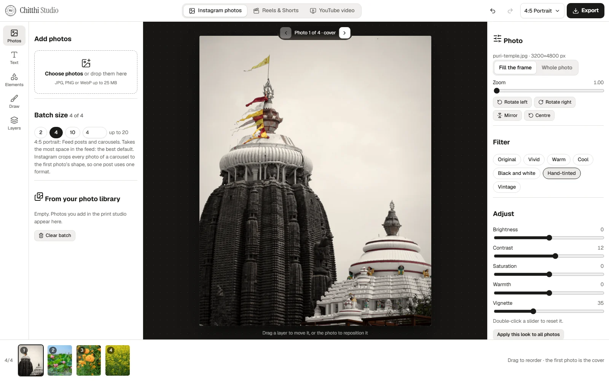<br /><sub><b>Photo editor</b>: light, colour, tone curve, colour mixer, detail, presets and LUTs</sub></td>
    <td width="50%">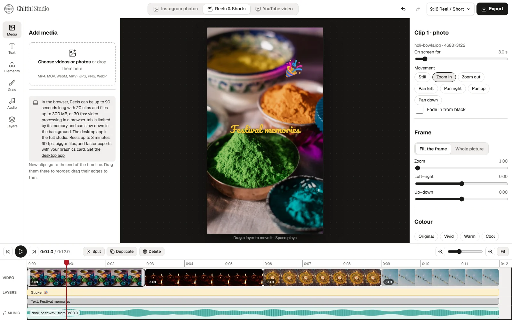<br /><sub><b>Reels & Shorts</b>: a 9:16 video with movement on photos, timed text and stickers, and music</sub></td>
  </tr>
</table>

<details>
<summary><b>Editing photos</b></summary>

- **The photo:** fill the frame or show the whole photo on a colour or blurred background; zoom, position, rotate,
  mirror. **Apply this look to all photos** copies the look to the batch.
- **Light and colour:** exposure (±4 stops), contrast, highlights, shadows, whites and blacks in linear light;
  temperature and tint with an eyedropper; saturation; a tone curve (RGB and per channel, keyboard too); a colour mixer
  (hue, saturation and luminance for eight bands).
- **Detail and effects:** sharpening with radius and edge masking, noise reduction, clarity, dehaze, vignette, grain.
- **Presets and LUTs:** seven built-in looks; save your own (applied to one photo or the batch, exported as a file
  that carries its LUTs); import `.cube` 3D LUTs with an amount.
- **Masks:** brush (size, feather, flow, erase), linear and radial gradients with handles, colour and brightness
  ranges, and **Subject, Background and Sky found by AI on your device**; parts combine by adding, subtracting or
  intersecting, and each mask has its own light, colour and detail settings. The sky model (176 MB) downloads once,
  only after you agree.
- **RAW:** camera RAW files (DNG, CR2, CR3, NEF, ARW, RAF, ORF, RW2 …) are developed in 16 bits by LibRaw in the
  desktop app; the web app opens the JPEG preview stored in them.
- **Layers:** text (six one-tap styles, any of the 46 fonts or your own, outline, background, shadow); 11 shapes,
  seven of which hold words; 40 emoji stickers; freehand drawings with pen, marker, highlighter and neon brushes;
  image layers for logos and textures. Every layer has a blend mode and can have a mask (a fade or a spot), and can be
  dragged, resized, turned, nudged with the keys, faded, hidden, reordered, duplicated and deleted. **Copy these layers
  to every photo** puts the same title on the whole batch.
- **Export:** JPEG, PNG, WebP and AVIF (where the browser writes them), and **TIFF (16-bit)** where the graphics card
  can render in floats; effects run on the graphics card (WebGPU or WebGL2) with the same pixels as the Canvas 2D path.
- **Batch:** drag photos to reorder (the first is the cover), 80 steps of undo, caption and hashtag counters
  (2,200 characters, 30 hashtags), a warning for files over 8 MB.

</details>

<details>
<summary><b>Editing video</b></summary>

- **Timeline:** drag clips to reorder, drag their edges to trim, drag text and stickers to time them, slide the music
  by its waveform, split and delete, zoom, frame-by-frame stepping; moves snap to edges and the playhead. Video clips
  show a filmstrip.
- **Per clip:** duration or trim, volume, Ken Burns movement for photos (zoom in or out, pan four ways), fade from
  black, framing, the same looks and adjustments as photos.
- **Layers:** the same text, shapes, stickers and drawings as photos, each with **Appears at** and **Disappears at**.
- **Export:** H.264 video and AAC sound (48 kHz stereo) in an MP4 with its index at the front (fast start), as
  Instagram requires. Reels are built in memory so they can be shared; YouTube videos stream to a file. Encoding uses
  the graphics card where the browser or OS allows.

</details>

**Browser or desktop.** Video work in a browser tab is limited by its memory, so the desktop app is the full studio:

| | Browser | Desktop app |
| --- | --- | --- |
| Reels & Shorts | Up to 90 s, 20 clips, 300 MB per file, 30 fps | Up to 3 min, 50 clips, 4 GB files, 30 or 60 fps |
| YouTube video | Up to 15 min, 60 clips, 4 GB files, 1080p, 30 fps | Up to 3 hours, 500 clips, 50 GB files, up to 4K, 30 or 60 fps |
| Saving long videos | Streamed to a file in Chrome and Edge; built in memory elsewhere | Streamed to a file |

Formats, limits with their sources, and how exports stay small in memory: [docs/MEDIA-STUDIO.md](docs/MEDIA-STUDIO.md).

## AI writing and pictures

AI is optional and off until you choose a service in **Settings → AI**:

1. Under **Keys and services**, paste an API key and press **Save and test**, or run [Ollama](https://ollama.com) or
   LM Studio on your computer for free, private writing.
2. Choose the service and model that **Writes words** and the one that **Makes pictures**.
3. Optionally set daily **Limits** (200 writing and 30 picture requests by default), so a mistake can't run up a bill.

| Feature | Where | What it does |
| --- | --- | --- |
| **Write with AI** | Front step | Greeting, quote and signature sized to the layout, in one of 12 languages and 5 tones |
| **Write captions with AI** | Calendar | All twelve month captions from each month's festivals |
| **Write the message with AI** | Back step | The message on the back of a postcard |
| **Create a picture with AI** | Photos step | Artwork in the shape of the selected slot, with no people or lettering, credited as AI in the app, the print pack and the printed credit line |

Services: Anthropic (Claude), OpenAI, Google Gemini, OpenRouter, Groq, DeepSeek, Mistral, Together, Stability, fal.ai,
Black Forest Labs, Replicate, Ideogram, a local Ollama or LM Studio, and a custom OpenAI-compatible service. Each bills
your own account. Keys stay on your device: in browser storage on the web, encrypted by the operating system in the
desktop app, where the page can never read them back. Black Forest Labs, Replicate and Ideogram refuse browser calls,
so they work in the desktop app only. Details: [docs/AI.md](docs/AI.md).

**AI masks need no service at all:** the photo editor's subject and sky models run on your device (ONNX Runtime Web in
a worker), with no key and no upload.

## AI agents (MCP)

The desktop app is an [MCP](https://modelcontextprotocol.io) server with 56 tools, 5 workflow prompts and 5
resources. For print (34 tools), an agent can create designs, write the words, find Pexels photos or create pictures,
check print quality, render previews and export print packs, PDFs and quote requests. For the photo studio (22 tools),
it can add photos (RAW too), set any colour setting on one photo or the whole batch, add masks (AI included), use and
save presets and LUTs, look at previews and export, 16-bit TIFF included.

In **Claude Code**, the plugin adds the server and six skills (festival postcard, year calendar, print quote, photo
sourcing, AI artwork, print samples):

```text
/plugin marketplace add RVicky172/Chitthi
/plugin install chitthi@chitthi
```

When asked, give the app's path (Windows: `%LOCALAPPDATA%\Programs\Chitthi Studio\Chitthi Studio.exe`, macOS:
`/Applications/Chitthi Studio.app/Contents/MacOS/Chitthi Studio`), then ask, for example, *"Make a Diwali postcard for
my Nani in Hindi with a Pexels photo and export the print pack"* or *"Add the photos in this folder, warm them up,
darken the sky with a sky mask and export 4:5 JPEGs"*. Files go to **Documents/Chitthi agent output**.

Other ways to connect:

- **Headless server only:** `claude mcp add chitthi -- "<path to Chitthi>" --mcp`
- **Live, in the open window:** turn on **Settings → AI → Let an agent work in this open window** and copy the command
  shown there; every change appears in the studio and can be undone.
- **Claude Desktop, VS Code, Cursor**, the tool reference and the security model: [docs/MCP.md](docs/MCP.md).

## Performance monitor

Open **More (⋯) → Performance monitor** in the studio (or search "performance" in **Find a feature**; **View →
Performance monitor** on desktop). A small panel shows, once a second while it is open:

| | Web | Desktop |
| --- | --- | --- |
| CPU | Main-thread load, estimated from long tasks (browsers don't report CPU) | Real CPU of every Chitthi process |
| Responsiveness | Input delay and frames per second | same |
| Memory | JavaScript heap (Chromium) | Whole-app memory, per process |
| Photos | Decoded photo memory and what the undo history holds | same |
| Page | Elements on the page, storage used | same |

Figures turn amber or red past sensible thresholds, and **Copy report** exports two minutes of samples as JSON to
compare runs or attach to an issue. What each figure means and the app's memory budgets:
[docs/PERFORMANCE.md](docs/PERFORMANCE.md).

## Keyboard shortcuts

<details>
<summary><b>Print studio</b></summary>

| Key | Action |
| --- | --- |
| `Ctrl+K` / `⌘K` | Find a feature |
| `Ctrl+Z`, `Ctrl+Shift+Z` / `Ctrl+Y` | Undo, redo |
| `Ctrl+S` | Save to gallery |
| `F` | Flip the card |
| Arrow keys (Shift for bigger steps), `+` / `−` | Move and zoom the photo in the selected slot |
| `Ctrl+,` (desktop) | Settings |

</details>

<details>
<summary><b>Photo & video studio</b></summary>

| Key | Action |
| --- | --- |
| `Ctrl+Z`, `Ctrl+Shift+Z` / `Ctrl+Y` | Undo, redo |
| Arrow keys, `+` / `−`, `Delete` | Nudge, resize, delete the selected layer |
| `Alt+←` / `Alt+→` | Move the focused photo in the strip |
| `Space` | Play or pause |
| `←` / `→`, `Shift+←` / `Shift+→`, `Home` / `End` | Step one frame, one second, to the start or end |
| `S`, `Delete` (timeline focused) | Split, delete the clip |
| `Ctrl` + wheel, `+` / `−` | Zoom the timeline |

</details>

## Web or desktop

Both are built from the same code and make the same files. The desktop app adds what a browser tab can't do well.

| | Web app | Desktop app |
| --- | --- | --- |
| Install | Any modern browser; installable as an app | Installer for Windows and macOS, auto-updates |
| Offline | After the first visit (service worker) | Always; fonts bundled |
| Saving | Browser downloads | Native **Save as…** dialogs, `.chitthi` files from the File menu |
| Storage | IndexedDB in the browser | JSON files in the app's data folder (**File → Open library folder**) |
| Video | Reels up to 90 s, YouTube up to 15 min at 1080p30 | Up to 3 hours, 4K, 60 fps, 50 GB files |
| RAW photos | The JPEG preview stored in the file | Developed in 16 bits by LibRaw |
| AI services | Those that allow browser calls | All, with keys encrypted by the OS |
| Extras | — | MCP server, real CPU and memory in the performance monitor, native menus |

The two keep separate libraries; move designs with **Gallery → Back up gallery / Restore a backup** or `.chitthi`
files. More: [docs/DESKTOP.md](docs/DESKTOP.md).

## Requirements

| | Needs |
| --- | --- |
| **Print studio** | Current Chrome, Edge, Firefox or Safari |
| **Video editor (web)** | WebCodecs: Chrome or Edge 94+, Firefox 130+, Safari 26. Saving long videos straight to a file needs Chrome or Edge |
| **Desktop app** | Windows 10 or later (x64), or macOS on Intel or Apple silicon |
| **Photos** | JPG, PNG or WebP up to 25 MB; camera RAW up to 300 MB (full RAW in the desktop app). iPhone HEIC photos must be converted to JPG first |
| **16-bit TIFF and fast effects** | A graphics card with WebGPU, or WebGL2 with float render targets (most computers from the last decade) |
| **Building from source** | Node.js 20.19+ or 22.12+; Docker for the web image |

## Privacy and security

- **Your data stays on your device.** Designs, the photo library, uploaded fonts, settings and AI keys are kept in
  IndexedDB and `localStorage` in the browser, or as files in the app's data folder on desktop. Nothing syncs between
  devices. Full policy: [PRIVACY.md](PRIVACY.md).
- **The only network calls** are fonts (web), Pexels search, the AI service you chose, the sky model for AI masks
  (downloaded once from Hugging Face, only if you agree, and checked by SHA-256), and update checks (desktop). There
  are no accounts and no analytics.
- **Hardened by default:** a strict Content Security Policy on web and desktop; a sandboxed, context-isolated desktop
  renderer that accepts IPC only from its own page; Electron fuses locked; AI keys attached only for known hosts and
  never sent on redirects. Self-hosted deployments that use a custom AI service must add its host to `connect-src` in
  `nginx/security-headers.conf`.
- **Reporting a vulnerability:** see [SECURITY.md](SECURITY.md); please don't open a public issue.

## Accessibility

Every control works with the keyboard, buttons have accessible names, messages are announced, text meets WCAG AA
contrast in both themes, animations respect reduced motion, and nothing scrolls sideways from 1920 to 360 px. Every
pull request runs an axe scan at desktop and phone sizes. Known limits (the canvas preview is one image to a screen
reader; not yet tested end to end with screen readers): [docs/ACCESSIBILITY.md](docs/ACCESSIBILITY.md).

## Documentation

| Document | Contents |
| --- | --- |
| **Using the app** | |
| Docs in the app (`#/docs`) | Getting started, the print studio, the photo and video editors, AI, questions; for developers: agents, self-hosting, building and extending |
| [MEDIA STUDIO](docs/MEDIA-STUDIO.md) | The photo & video studio: Instagram formats and limits with sources, layers, the timeline, Reels and YouTube export, browser vs desktop |
| [SPECIFICATIONS](docs/SPECIFICATIONS.md) | Print specifications, where they live, adding sizes, layouts and products |
| [Print quotes](docs/print-quote/README.md) | Ready-to-send specification and quote PDFs for printers |
| [AI](docs/AI.md) | AI services, web vs desktop, keys and privacy, limits, credits, adding a provider |
| [MCP](docs/MCP.md) · [Claude Code plugin](plugins/chitthi/README.md) | The MCP server, tools, resources, prompts and security; the plugin and its skills |
| [PEXELS](docs/PEXELS.md) | The Pexels connection, API key, proxying, licensing |
| [DESKTOP](docs/DESKTOP.md) | Desktop app: differences from web, data folder, signing, updates |
| [TROUBLESHOOTING](docs/TROUBLESHOOTING.md) | Fixes for common problems with photos, saving, printing and installing |
| [ACCESSIBILITY](docs/ACCESSIBILITY.md) | Accessibility target, what is checked, known limits |
| [PERFORMANCE](docs/PERFORMANCE.md) | The performance monitor, memory and CPU budgets, how to investigate a slowdown |
| [OPERATIONS](docs/OPERATIONS.md) | Running the web app in production: container, TLS and HSTS, headers, upgrade, rollback |
| **Engineering (`specs/`)** | |
| [specs/](specs/README.md) | How Chitthi is built: the [constitution](specs/constitution.md) (principles and Definition of Done), the spec-driven [workflow](specs/workflow.md) and the [roadmap](specs/roadmap.md) |
| [Architecture](specs/architecture.md) · [LLD](specs/lld.md) | High-level design (context, deployment, flows, storage, security, decisions, conventions); low-level design (modules, data model, store, rendering, export, IPC) |
| [Tech stack](specs/tech-stack.md) | The stack, why each piece is used, and what was rejected |
| [Testing](specs/testing-strategy.md) | The test suites, what each covers, and how to add tests |
| [Licensing](specs/licensing.md) | Licence policy for libraries, models and assets: what may ship, obligations, checklist |
| [Build](specs/build.md) · [Release](specs/release.md) | Scripts, web and Docker build, desktop packaging; release checklist, signing, what to do when a release goes wrong |
| [Vision](specs/vision/README.md) | The [editor roadmap](specs/vision/editor-roadmap.md) and its [implementation plan](specs/vision/editor-implementation.md) |
| **Project** | |
| [SECURITY](SECURITY.md) · [PRIVACY](PRIVACY.md) | Reporting vulnerabilities; what data goes where |
| [CONTRIBUTING](CONTRIBUTING.md) · [CHANGELOG](CHANGELOG.md) | How to contribute; what changed in each release |
| [THIRD_PARTY_NOTICES](THIRD_PARTY_NOTICES.md) | Libraries, fonts and photos used, and their licences |

## Development

**Tech stack:** React 19 and TypeScript (strict) on Vite; Canvas 2D for every print file and WebGPU / WebGL2 for photo
effects; jsPDF for PDFs; WebCodecs and [Mediabunny](https://mediabunny.dev) for video; ONNX Runtime Web for AI masks;
LibRaw for RAW photos (desktop); Electron for the desktop app; nginx in Docker for the web. No backend. Why each piece: [specs/tech-stack.md](specs/tech-stack.md).

```text
src/
  main.tsx, App.tsx     Entry, screens (home, studio, sizes guide, paper sizes in 3D, photo & video studio), routing, shortcuts
  types.ts              Shared types (Design, Photo, Layout, SizeDef, …)
  data/                 Specifications as data: products, sizes, layouts, themes, fonts, holidays, Instagram formats, presets, the in-app docs
  engine/               Framework-free: print layout and rendering, PDF / PNG / ZIP export, the photo engine (light, curves, masks, LUTs,
                        GPU pipeline, RAW, 16-bit render, TIFF), layers, video and MP4 export
  state/                Stores with undo/redo: print design (autosaved), photo batch, video project; photo slots and library
  lib/                  Storage, fonts, Pexels client, performance sampler, downloads, file streaming, ZIP, toasts, error log
  ai/                   AI service, prompt templates, provider adapters (loaded on demand), keys, transport; segment/ = AI masks
  agent/                Agent tools, MCP prompts and resources, and the page side of the MCP bridge
  platform/             Desktop bridge and menu commands
  components/           React UI: pages, print studio panes, photo & video studio, dialogs, 3D views, menus, performance monitor
  styles.css, styles/   The stylesheet, split by feature (numbered files keep the cascade order)
electron/               Desktop main process, preload bridge, IPC guard, AI requests, the MCP server and the RAW developer
plugins/chitthi/        Claude Code plugin: MCP server config and skills
public/                 Service worker, manifest, icons, sample photos, landing renders
nginx/                  Web server config, security headers and CSP
e2e/                    Playwright browser tests
scripts/                Build checks, licence check, downloaders, generators and renderers
docs/                   Design, operations and planning documentation, screenshots
```

| Command | What it does |
| --- | --- |
| `npm run dev` / `npm run desktop:dev` | Web dev server on `http://localhost:5173` / desktop app with hot reload |
| `npm run lint` | ESLint over the app, the Electron main process and the scripts |
| `npm run typecheck` | Strict type check of the app and tooling |
| `npm run check:licenses` | Fails if anything the app ships has a licence outside [the policy](specs/licensing.md) |
| `npm run build` | Type check, production bundle, and a check that the start-up script stays under 350 KB with no AI code in it |
| `npm run test:unit` | Vitest unit tests: design loading, photo processing, Instagram layout and colour maths, layers and the video timeline, where API keys may be sent |
| `npm test` | Renders every product × size × orientation × layout (front, back, envelope), builds a print pack per product, compares the GPU and Canvas 2D photo paths (and the 16-bit render), runs the AI subject model, and checks saved designs, festival dates, credits, AI (against a fake provider), every agent tool and the performance sampler, inside Electron |
| `npm run test:mcp` | Runs the MCP server end to end with the official MCP client: a print design, a photo edit with an AI mask, and a RAW developed to a 16-bit TIFF |
| `npm run test:e2e` | Playwright browser tests of the production build at desktop and phone sizes (print studio, Instagram photos, Reel and YouTube exports), with an axe accessibility check |
| `npm run fetch:libraw` | LibRaw's RAW developer for the desktop app (needed by `test:mcp` too) |
| `npm run screenshots` | Remakes the README screenshots from the running app |
| `npm run desktop:pack` / `desktop:dist` | Unpacked desktop app / installers in `release/` |

All scripts: [specs/build.md](specs/build.md). How the tests work and how to add one: [specs/testing-strategy.md](specs/testing-strategy.md).

## Roadmap

Done: the shared GPU pipeline and the advanced photo editor (light and colour, curves, mixer, detail, presets and LUTs,
masks with AI, blend modes and image layers, WebP / AVIF, RAW and 16-bit TIFF, agent tools), released as 2.10.0 once
its last check passes. Next: a multi-track timeline (keyframes, transitions, speed, audio tracks), then a colour page
(wheels, scopes, auto captions). Every one of these will be free for everyone, in the web and desktop apps, like everything in Chitthi
today. The plan is in [specs/vision/](specs/vision/README.md) and the status of each feature in [specs/roadmap.md](specs/roadmap.md). Ideas and bug reports
are welcome as [issues](https://github.com/RVicky172/Chitthi/issues/new/choose).

## Contributing

Contributions are welcome. [CONTRIBUTING.md](CONTRIBUTING.md) covers setup, the checks CI runs, code style and pull
requests. New libraries, models, fonts and other assets must follow the [licensing policy](specs/licensing.md).

## License

Chitthi is free for everyone to use, copy, change and share, including commercially, under the [MIT License](LICENSE).
It has no paid edition and no subscription: every feature, present and planned, is in the open-source app.
Third-party parts (fonts, icons, libraries, sample photos) keep their own licences: see
[THIRD_PARTY_NOTICES.md](THIRD_PARTY_NOTICES.md). Designs and files you make with Chitthi are yours.
