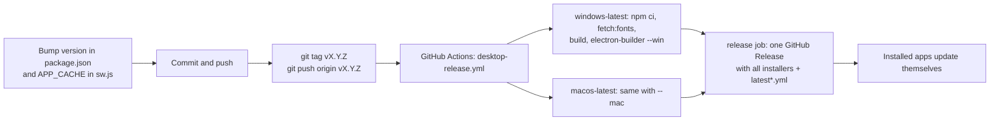

# Build, run and release

How Chitthi is built for each target, how the running app works, and how a new version gets to users.

## Prerequisites

- Node.js 20.19+ or 22.12+ (CI uses 22). `npm run docs:specs` needs 22.18+ because it runs TypeScript files directly.
- For the desktop app: Windows builds on Windows, macOS builds (DMG) on macOS.
- Optional: Docker, and a Pexels API key in `.env.local` (see [PEXELS.md](PEXELS.md)).

```bash
npm install
cp .env.example .env.local   # optional: PEXELS_API_KEY=… for photo search in dev and preview
```

## Scripts

| Script | What it does |
| --- | --- |
| `npm run dev` | Vite dev server on http://localhost:5173 with hot reload; proxies `/api/pexels` when a key is set |
| `npm run typecheck` | `tsc -b`: strict type check of app and tooling |
| `npm run build` | Type check, then production bundle into `dist/` |
| `npm run preview` | Serves `dist/` on http://localhost:8080 (same Pexels proxy) |
| `npm run build:lib` | Emits `.d.ts` files to `dist-lib/types` for the design-system sync (`src/index.ts`) |
| `npm run fetch:samples` | Downloads the gallery sample photos from Pexels into `public/samples/` with credits (needs the key) |
| `npm run fetch:fonts` | Downloads every card and UI font into `electron/resources/fonts/` for the offline desktop app |
| `npm run docs:specs` | Regenerates the size and layout tables in `docs/SPECIFICATIONS.md` from the data files |
| `npm run fetch:showcase` | Downloads the landing page example photos from Pexels into `showcase-src/` (needs the key) |
| `npm run build:showcase` | With `npm run dev` running: renders the landing examples (`src/data/showcase.ts`) into `public/showcase/*.webp` and `src/data/showcase.json`, using Electron |
| `npm run build:favicons` | Renders every icon in `public/favicon/` and the desktop icon `build/icon.png` from the two SVG sources (uses Electron) |
| `npm run desktop:dev` | Vite dev server + Electron, with hot reload |
| `npm run desktop:start` | Production build shown in Electron, exactly as users get it |
| `npm run desktop:pack` | Unpacked app in `release/` for a quick check |
| `npm run desktop:dist` | Installers in `release/` for the current OS |
| `npm run desktop:release` | Build and publish to GitHub Releases (CI uses the workflow instead) |

## Web build

`npm run build` runs `tsc -b` and `vite build`:

- Output goes to `dist/`: `index.html`, content-hashed `assets/*.js|css`, and everything from `public/` (service
  worker, manifest, icons, `samples/`).
- `base: './'`, so the build works from any path (a sub-folder, `app://` in Electron).
- jsPDF is split into its own chunk and loaded only when a PDF is made.
- No secrets are compiled in. `PEXELS_API_KEY` has no `VITE_` prefix; Vite only uses it in the dev/preview server
  proxy.

### Docker

```bash
docker compose up -d --build        # http://localhost:8080
```

`Dockerfile` is two stages: `node:22-alpine` runs `npm ci && npm run build`, then
`nginxinc/nginx-unprivileged:1.27-alpine` serves `dist/` on port 8080 as a non-root user. The compose file runs it
read-only with a tmpfs `/tmp` and no capabilities. nginx (`nginx/default.conf`):

- caches `/assets/*` (hashed) for a year, and always revalidates `index.html`, `sw.js` and the manifest;
- falls back to `index.html` for unknown paths;
- adds the security headers and CSP from `nginx/security-headers.conf` to every response;
- answers `GET /healthz` with `ok` for the container health check.

Serve it over HTTPS (behind Caddy, Traefik or another nginx) for the service worker to register on a real domain.

## How the running app works

1. `index.html` loads `src/main.tsx`: it applies the saved light/dark theme before first paint, mounts `<App>`, and
   in production web builds registers the service worker.
2. `App` reads the URL hash to choose the screen (home, `#/studio`, `#/sizes`), restores the last card's photos from
   storage, and starts loading the fonts the design uses.
3. The studio keeps one `Design` object in the store. Every control writes to it; the stage re-renders through the
   engine; changes are autosaved and become undo steps (see [LLD.md](LLD.md) §3).
4. Exports render every page again at print resolution in the browser, and download a ZIP, PDF or PNG.
5. **Offline**: `public/sw.js` caches the app shell and hashed assets (cache-first) and Google Fonts
   (stale-while-revalidate). Pages are network-first so updates arrive. `/api/*` is never cached.

After changing the web app, bump `APP_CACHE` in `public/sw.js` (for example `chitthi-app-v6`) so returning visitors
drop the old cache.

## Desktop build

The desktop app is the same `dist/` inside Electron ([DESKTOP.md](DESKTOP.md) has the full guide):

- `electron/main.cjs` registers the `app://chitthi` scheme, serves `dist/` and the bundled fonts from it with a strict
  CSP, stores the library as JSON files, and provides dialogs, menus, the `.chitthi` file association and updates.
- `electron/preload.cjs` exposes `window.chitthiDesktop`, the only bridge from the sandboxed page. The web code
  detects it (`src/platform/desktop.ts`) and switches storage, downloads and menus.
- `electron-builder.yml` packages `dist/`, the two electron scripts and `package.json`, adds
  `electron/resources/fonts` as `fonts/`, and builds an NSIS installer (Windows x64) and DMG + ZIP (macOS x64 and
  arm64). The ZIPs and `latest*.yml` files feed the auto-updater.

Local installers:

```bash
npm run fetch:fonts      # once; the fonts folder is gitignored
npm run desktop:dist     # release/Chitthi-Setup-<version>-x64.exe or Chitthi-<version>-<arch>.dmg
```

## Releasing a new version



1. `npm version X.Y.Z --no-git-tag-version` (updates `package.json` and the lock file), bump `APP_CACHE`, and update
   the image tag in `docker-compose.yml`.
2. Run `npm run typecheck && npm run build` (and `npm run docs:specs` if specifications changed).
3. Commit and push, then `git tag vX.Y.Z && git push origin vX.Y.Z`.
4. The **Desktop release** workflow builds both platforms in parallel and a final job publishes the GitHub Release.
   A manual run (`workflow_dispatch`) builds the installers as artifacts without publishing.
5. Redeploy the web app: `docker compose up -d --build` on the server.

Signing: without certificates the builds are unsigned (Windows SmartScreen and macOS Gatekeeper warnings; the release
notes explain the workaround). Add `WIN_CSC_LINK`, `WIN_CSC_KEY_PASSWORD`, `MAC_CSC_LINK`, `MAC_CSC_KEY_PASSWORD`, and
for notarization `APPLE_ID`, `APPLE_APP_SPECIFIC_PASSWORD`, `APPLE_TEAM_ID`, as repository secrets. See
[DESKTOP.md](DESKTOP.md).

## Environment variables

| Variable | Where | Purpose |
| --- | --- | --- |
| `PEXELS_API_KEY` | `.env.local` (gitignored) | `fetch:samples`, and the dev/preview server proxy for photo search. Never shipped |
| `CHITTHI_DEV_URL` | set by `electron/dev.mjs` | Tells Electron to load the Vite dev server |
| `CSC_LINK`, `CSC_KEY_PASSWORD`, `APPLE_*` | CI secrets | Code signing and notarization |
