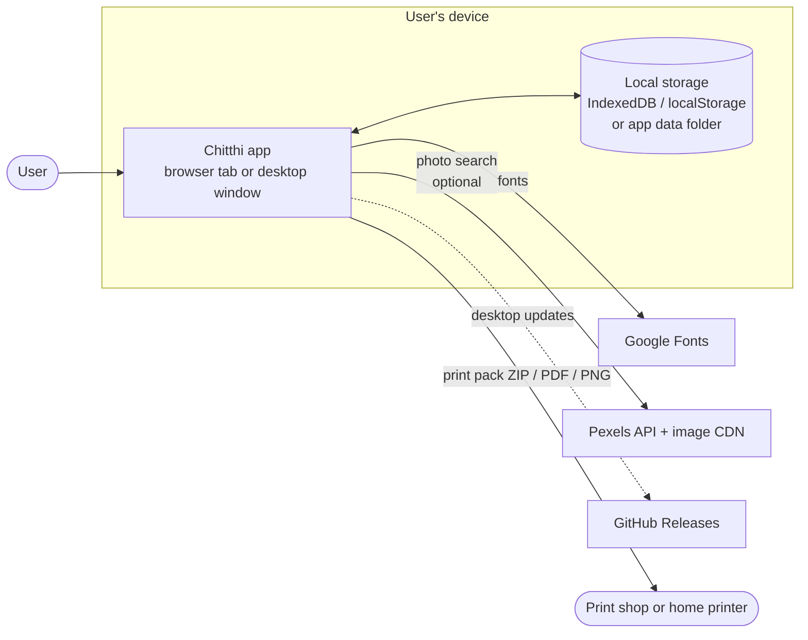
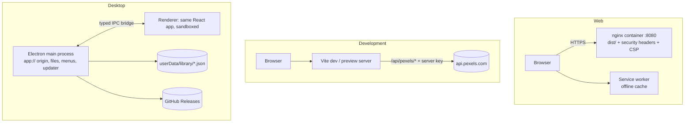
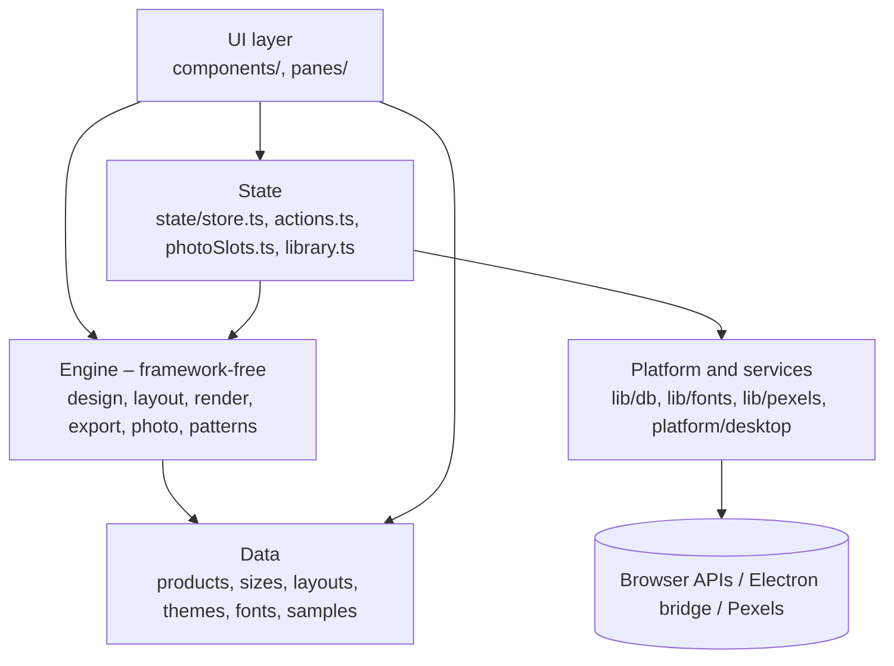

# Chitthi – High-level design

## 1. Purpose and scope

Chitthi is a print studio for personal photo products: **postcards** (including Instax-style prints),
**calendars**, **photo-frame prints** and **fridge magnets**. Users add photos, pick a size and layout, apply an
Indian festival, birthday or season theme, write their words, and download print-ready files: PNGs and PDFs with
bleed and crop marks, plus a specification sheet for the print shop.

It ships as:

- a **web app**: static files served by nginx (Docker image) or any static host;
- a **desktop app** for Windows and macOS: the same web app inside Electron, fully offline, with native files and
  auto-updates.

Out of scope: accounts, cloud storage, ordering or payment, and server-side rendering. There is no Chitthi backend.

## 2. System context

- Photos never leave the device, except that Pexels photos are downloaded *to* it.
- The only outbound calls are fonts (web only), optional Pexels search, and update checks (desktop only).

## 3. Deployment views

| Target | Serves | Storage | Fonts | Pexels access |
| --- | --- | --- | --- | --- |
| Web (Docker/nginx) | `dist/` over HTTPS | Browser (IndexedDB, localStorage) | Google Fonts, cached by the service worker | User's key from Settings |
| Dev / preview | Vite | Browser | Google Fonts | Server proxy with `.env.local` key, or user's key |
| Desktop | `app://chitthi` from the packaged `dist/` | JSON files in the app data folder | Bundled `.woff2` | User's key from Settings |

## 4. Building blocks

| Block | Responsibility |
| --- | --- |
| **Data** (`src/data/`) | Declarative specifications: products, sizes, layouts, themes and wishes, fonts, gallery samples |
| **Engine** (`src/engine/`) | Pure drawing and file logic. Given a `Design` and photos it computes layouts, draws any face at any resolution, and builds PDFs, PNGs and the ZIP pack. No React |
| **State** (`src/state/`) | One app store (design, photos, UI) with undo/redo and autosave; user actions such as adding photos, switching product, export and gallery |
| **UI** (`src/components/`) | Landing page, studio (header, step rail, step panes, live stage), gallery, 3D viewer, crop tool, sizes guide, settings |
| **Platform and services** (`src/lib/`, `src/platform/`) | Storage abstraction (IndexedDB or desktop files), font loading, Pexels client, desktop bridge and menus |
| **Desktop shell** (`electron/`) | Window, `app://` protocol with CSP, file-based library, save/open dialogs, menus, file association, auto-update |

## 5. Key flows

**Designing.** Every edit updates the `Design` in the store. The stage canvas re-renders the current face with
`renderCard()` at screen resolution, and thumbnails redraw at low priority. After 400 ms of quiet the change becomes
an undo step and the design is saved to `localStorage`; photos go to IndexedDB (or disk) after 1.2 s.

**Exporting.** The same `renderCard()` draws each page at the chosen dpi with bleed. The export module places pages
in a PDF (one per page, or imposed many-up on a sheet with mirrored backs), writes PNGs with their dpi, and
packs everything with a `PRINT-SPEC.txt` into a ZIP. On desktop the file goes through a native Save dialog.

**Calendars.** One design yields up to 12 month pages plus a year-at-a-glance back. Each page moves on through the
photo list, and each month can have its own caption. The month strip, export and 3D ring all render the pages from
the same function.

**Photo library.** The **Photos** button in the header opens every photo on the device. Each is measured against the
selected slot of the current layout: its shape (how much a cover crop would cut away) and the print resolution it
reaches there, so "Fits this slot" shows only suitable photos. Upload, crop, take off and delete happen in place.

**Envelopes.** Every design has a matching envelope: the smallest standard envelope the piece fits, drawn from the
same occasion, fonts, greeting and photo. The print pack adds a print-on-envelope PDF, PNGs and a fold-your-own
template on the smallest sheet it fits; the 3D viewer shows it with an opening flap and the card sliding out.

**Custom fonts.** Uploaded TTF / OTF / WOFF fonts are stored on the device and registered with the FontFace API, so
they draw on the canvas and in print files like built-in families.

**Photo search.** The Photos step asks Pexels for photos that match the design (month, occasion, product) and the
shape of the selected slot. A chosen photo is downloaded, converted to a data URL and handled exactly like an
upload. See [PEXELS.md](PEXELS.md).

**Saving and sharing.** The gallery stores designs with photos and rendered thumbnails. Designs can be exported as
single `.chitthi` files or a whole-gallery JSON backup, and restored on another device or app.

**Desktop updates.** On start, the packaged app checks GitHub Releases through electron-updater and offers to
install newer versions. A `v*` tag pushed to GitHub builds and publishes both platforms ([BUILD.md](BUILD.md)).

## 6. Data and storage

| Data | Web | Desktop | Lifetime |
| --- | --- | --- | --- |
| Current design | `localStorage` `chitthi-v3` | same (app origin) | Until replaced |
| Last design per product | `localStorage` `chitthi-product-<id>` | same | Until replaced |
| Current card's photos | IndexedDB `chitthi` / `work` | `library/work.json` | Until replaced |
| Photo store (every upload) | IndexedDB `library` | `library/photos/<id>.json` | Until deleted |
| Gallery designs | IndexedDB `designs` | `library/designs/<id>.json` | Until deleted |
| Settings (Pexels key, search on/off, theme) | `localStorage` | same | Until changed |
| Uploaded fonts | IndexedDB `chitthi-fonts` (names also in `localStorage`) | same (IndexedDB in the app) | Until deleted in Settings |

Photos are stored as data URLs so designs, backups and `.chitthi` files are self-contained.

## 7. Security

- **No server-side user data.** Nothing is uploaded; there is nothing to breach centrally.
- **Content Security Policy** in both nginx and Electron: scripts only from the app itself; images and connections
  only to the app itself, Google Fonts and the two Pexels hosts; no frames, objects or form posts.
- **Desktop isolation**: the renderer is sandboxed without Node. It reaches the system only through the small
  `window.chitthiDesktop` bridge. File ids are validated, and only files the session saved can be shown in the folder.
- **API keys**: no key is compiled into the bundle. A user's Pexels key stays on their device and is sent only to
  `api.pexels.com`. The dev proxy key stays in the Vite server process.
- **Headers** (web): `X-Content-Type-Options`, `Referrer-Policy`, `X-Frame-Options`, `Permissions-Policy` and COOP.
  The container runs as non-root with a read-only file system.

## 8. Quality attributes

| Attribute | Approach |
| --- | --- |
| Print accuracy | All geometry in millimetres; rendering scales by pixels-per-mm, so preview and 300 dpi output share one code path. Bleed extends edge-touching photos; guides show trim and safe area |
| Offline | Service worker (web); everything bundled (desktop) |
| Performance | Lazy jsPDF; deferred thumbnail redraws; per-session caches for sample renders and Pexels results; photos pre-processed once (crop, rotate, look) |
| Accessibility | Keyboard-operable stage (arrow keys and zoom), labelled controls, live regions, WCAG AA contrast in both themes, reduced-motion support |
| Maintainability | Specifications as data ([SPECIFICATIONS.md](SPECIFICATIONS.md)); engine free of UI code; strict TypeScript with exhaustive `Record<ProductId, …>` maps |
| Portability | One build for web and desktop; platform differences are behind `lib/db.ts` and `platform/desktop.ts` |

## 9. Main design decisions

| Decision | Reason | Trade-off |
| --- | --- | --- |
| No backend | Privacy, zero running cost, works offline | No sync between devices (backups and `.chitthi` files instead) |
| Canvas renderer for preview and print | Pixel-identical output at any dpi | Text layout implemented by hand (wrapping, fitting) |
| Data URLs for photos | Self-contained designs and backups | Larger storage use than blobs |
| Electron wrapping the web build | One code base for three platforms | Large installers (~120 MB) |
| Pexels key from Settings, optional proxy | Key never ships in the bundle; each deployment chooses | Users of a proxy-less build must get their own key |
