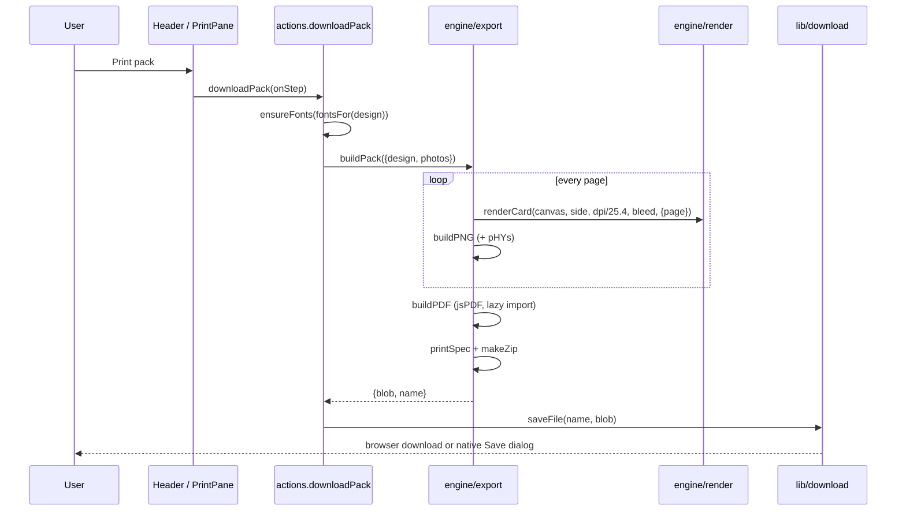

# Chitthi – Low-level design

This document describes the modules, data model and algorithms behind the [high-level design](HLD.md). Paths
are relative to the repository root.

## 1. Module map

```text
src/
  main.tsx                 Entry: applies the saved theme, loads bundled UI fonts on desktop, mounts <App>, registers the service worker
  App.tsx                  Screens (home / studio / sizes), hash routing, start-up effects, keyboard shortcuts
  index.ts                 Library entry for the design-system sync (re-exports; never mounts)
  types.ts                 Every shared type: Design, Photo, Layout, SizeDef, CalendarSettings, …
  data/                    Specifications as data
    products.ts              PRODUCTS, productOf, sizesFor, MONTHS
    sizes.ts                 SIZES, SIZE_GROUPS, sizeLabel
    layouts.ts               LAYOUTS (id, name, product), LOOKS
    themes.ts                25 occasion themes: colours, patterns, fonts, greetings, quotes
    fonts.ts                 46 font families with category and weights
    samples.ts               Gallery samples built from Pexels photos in public/samples/
    showcase.ts, .json       Landing page examples (definitions) and their pre-rendered images (manifest)
  engine/                  Framework-free; no React imports
    design.ts                DEFAULT_DESIGN, productDesign, mergeDesign, cardMM, calPages, cornerMM, resolveTheme, inks
    layout.ts                computeLayout, slotCount, slotPhotoIndex
    render.ts                renderCard and every drawing routine (fronts, backs, calendars, badge, guides)
    patterns.ts              Procedural occasion artwork (PAT)
    photo.ts                 File checks, loading, makePhoto / updatePhoto (crop, rotate, looks)
    export.ts                pagesOf, nup, buildPDF, buildPNG, printSpec, buildPack, envelope PDFs
    envelope.ts              Envelope size, front / back / 3D layers, fold-your-own template
    color.ts, sample.ts      Colour maths and drawing helpers; painted stand-in photos
  state/
    store.ts                 App store, undo/redo, persistence, setters
    actions.ts               User actions (photos, products, export, gallery, backup, 3D)
    photoSlots.ts            Photo ↔ slot mapping, slot selection
    library.ts               Photo store (every upload), putOnCard
    photoFit.ts              Photo shape vs slot shape, crop loss, print dpi in a slot, learned pixel sizes
  lib/
    db.ts                    Storage API: IndexedDB in browsers, IPC to files on desktop
    fonts.ts                 On-demand font loading (Google Fonts or bundled)
    pexels.ts                Pexels client, key and settings storage, suggestions
    userFonts.ts             Uploaded fonts: IndexedDB storage, FontFace registration
    download.ts, zip.ts, toast.ts, theme.ts
  platform/
    desktop.ts               Typed window.chitthiDesktop bridge (absent in browsers)
    menu.ts                  Desktop menu commands → actions
  dev/showcase.ts          Development only: renders the landing examples for npm run build:showcase
  components/              React UI (section 8)
electron/
  main.cjs                 Main process: window, app:// protocol + CSP, file library, dialogs, menus, updater
  preload.cjs              contextBridge: the only system access for the page
  dev.mjs                  Runs Vite + Electron together for development
scripts/                   fetch-samples, fetch-fonts, spec-tables (docs)
```

Dependency rule: `components → state → engine → data`. `engine` never imports from `state` or `components`, so it
can render and export in any context: preview, thumbnails, gallery samples or the sizes guide.

## 2. Data model

### Design (`src/types.ts`)

The complete, serialisable description of one piece. It is saved as JSON in `localStorage`, the gallery, backups
and `.chitthi` files.

| Group | Fields |
| --- | --- |
| Product and size | `product: 'postcard'｜'calendar'｜'frame'｜'magnet'`, `sizeId`, `custom {w,h}` (mm), `orient` |
| Look | `useOccasion`, `themeId`, `group`, `artwork`, `decor`, `plain {bg, ink, accent, gradient}`, `frame` (paper / mat / border colour), `mat` (frame prints) |
| Layout | `layout: LayoutId` |
| Words | `heading`, `quote`, `sig`, `show*` flags, `insta`, `headFont`, `quoteFont`, `textScale`, `vAlign`, `hAlign`, `customColor`, `color`, `scrim`, `ornament` |
| Back | `back {message, font, from, to, address, pin, stamp, label, tint}` |
| Calendar | `cal {year, start, months: 1｜12, weekStart, text: 'off'｜'caption'｜'photo', captions[12], titleAlign, numbers, grid, font, backQuote}` |
| Export | `exp {format: 'pdf'｜'sheet'｜'png', sheet, bleed, dpi, quality, marks, back}` |
| Meta | `designName` |

`mergeDesign(saved)` makes any stored object safe: it starts from `DEFAULT_DESIGN`, keeps only known keys,
deep-merges nested groups, pads `cal.captions` to 12, and resets a size, layout or font that no longer exists for
the product. Every load goes through it, so old saves keep working.

### Photo

`PhotoMeta` (serialisable): `name, url (data URL), rot, flip, crop {x,y,w,h} (0–1), zoom, px, py (−1…1), look`.
`Photo` adds runtime fields: `id`, `orig` (the decoded image), and `src / sw / sh` (the processed source).

### Specifications

`SizeDef {id, grp, products?, name, L, S (mm), inch?, tag?, instax?, native?, corner?, shape?}` and
`ProductDef {id, name, short, blurb, backLabel, paper, defaults}`. See [SPECIFICATIONS.md](SPECIFICATIONS.md).

### Layout (result of `computeLayout`)

| Field | Meaning |
| --- | --- |
| `slots: Slot[]` | Photo windows: `{x,y,w,h}` plus `s` shape (`rect｜round｜circle｜arch`), `bleed`, and `d`, the drawing rect extended into the bleed when the slot touches the trim edge |
| `text: Rect｜null` | Zone for greeting / quote / signature; `onPhoto` makes it white with a shadow |
| `textFill?` | Text height as a share of the zone height (default 0.32; calendar caption bands use 0.7) |
| `bg`, `frame`, `paper`, `band`, `overlay`, `frameLine`, `mat` | What is painted behind and around the photos |
| `stamp`, `post` | Postage-stamp layout pieces |
| `calTitle`, `calGrid`, `calYear` | Calendar month title, day grid, or the 12-month grid of the Year strip |
| `scrimArea?` | Limits "darken the photo" to the photo (calendars) |
| `arc?` | Badge magnet ring for curved lettering |

## 3. State (`src/state/store.ts`)

```ts
interface AppState { design: Design; photos: Photo[]; ui: UIState; designId: string | null; canUndo; canRedo }
interface UIState  { side, guides, pane, cropId, slot, viewer, gallery, settings, screen: 'home'|'studio'|'sizes', calPage, fontTick }
```

- A module-level object plus a listener set. Components subscribe with `useApp(selector)`, built on
  `useSyncExternalStore`. Selectors must return stable references or primitives.
- `set(patch, track)`: tracked changes (design or photos) schedule **persistence** and **history**; UI changes
  (`setUI`) do not.
- **History**: `scheduleCommit()` debounces for 400 ms, then `commit()` pushes `{design, photos}` (a stack of up to
  100). Undo and redo restore snapshots by reference. Photo objects are immutable, so snapshots are cheap.
- **Persistence**: design → `localStorage['chitthi-v3']` after 400 ms. Photos → `db.putWorkPhotos` after 1.2 s, only
  when a signature (names, URL lengths, edits) changed.
- Setters: `setDesign(patch | fn)`, `setBack`, `setExp`, `setPlain`, `setPhotos`, `patchPhoto`, `setUI`,
  `replaceCard`.
- Routing helpers: `screenOf(hash)` / `hashOf(screen)` map `#/studio`, `#/sizes` and home.

### Actions (`src/state/actions.ts`)

| Action | What it does |
| --- | --- |
| `addFiles(files)` | `checkFile` → data URL → `makePhoto`; fills up to `maxPhotos(product)`; every good file also goes to the photo store; returns user messages |
| `selectSize(s)` | Sets the size; Instax sizes also force the Instax layout and an A4 sheet without bleed |
| `switchProduct(p)` | Saves the current design under `chitthi-product-<old>`, restores or creates the other product's design, keeps photos |
| `downloadPack / downloadPrintFile / downloadPNG` | Ensure fonts, run the export engine, `saveFile` (browser download or native dialog) |
| `open3D()` | Renders front, back and (calendars) every month page to JPEG data URLs → `ui.viewer` |
| `saveDesign / openDesign / newCard` | Gallery record with photo metas and 900 px thumbnails |
| `exportBackup / exportDesignFile / importText` | JSON gallery backup, single `.chitthi` file, validated import |
| `restoreWork()` | On start, reloads the previous card's photos |
| `openSample()` | Loads a gallery sample into the studio |

### Photos and slots (`photoSlots.ts`, `library.ts`)

The **order of `photos` is the assignment**: slot `i` on page `p` shows `photos[slotPhotoIndex(i, n, p, count)]`,
which is `(p × count + i) mod n`. Calendars therefore move through the list month by month. Placing a photo in a
slot swaps two list positions, so undo, autosave and export need no extra state. `putOnCard(storedPhoto)` adds a
stored or downloaded photo: move it if it's already on the card, fill an empty slot, add it, or replace the photo
in the selected slot when the card is full.

## 4. Engine

### 4.1 Geometry (`design.ts`, `layout.ts`)

- `cardMM(d)` gives the trim size in mm for the orientation (custom sizes are clamped by the UI to 40–420 mm).
- `renderCard(canvas, side, pxPerMM, bleedMM, input, opts)` sizes the canvas to `(w + 2·bleed) × (h + 2·bleed) ×
  pxPerMM` and defines the box `B = {x: e, y: e, w, h, e}` in canvas pixels, where `e` is the bleed in pixels.
- `computeLayout(id, B, d)` returns a `Layout` in the same pixel space. Shared metrics: `m = min(w, h)`,
  `pad = 0.075m`, `gap = 0.016m`, `u = m/100`. Because every value is relative to the box, one layout works at any
  size and dpi. Helpers: `rs()` makes a bleed slot, `plain()` an inset slot, `right()` / `below()` the text zone
  beside or under a photo. At the end, slots touching the trim are extended into the bleed (`extend()`).
- **Calendars**: each calendar layout defines a photo region and an *area*. When `cal.text` is `photo`, the text
  zone is the photo inset by 8%, with white ink and the scrim limited to the photo. When it is `caption`, a band
  of `min(0.12·area.h, 0.09·area.w)` is taken from the top of the area. The rest splits into `calTitle` (about 19%)
  and `calGrid`. For the **Year strip** it splits into a year title and `calYear`.
- **Badge magnet**: a circular photo of radius `r − band` inside a ring; `arc` describes the ring for lettering.

### 4.2 Rendering (`render.ts`)

`drawFront` runs in this order:

1. Background: paper colour (`frame` layouts), occasion gradient and patterns (`bg`), or nothing (full-bleed).
2. Paper card and stamp shapes.
3. Photo slots: `drawSlot` clips to the slot shape and draws the photo with **cover** scaling
   (`max(w/sw, h/sh) × zoom`), offset by `px, py`. Empty slots show a hatched "Add a photo" hint in the preview.
4. Mat bevels (frames), stamp text and postmark, calendar band, occasion overlay decoration, frame line.
5. Words: `drawText` lays out heading / ornament / quote / signature (`layoutText` + `wrapLines`). It starts at
   `min(Z.w × 0.13, Z.h × textFill) × textScale` and shrinks by 7% until everything fits the zone, then aligns
   with `vAlign` / `hAlign`. On a calendar, `calendarWords()` substitutes that month's caption for the greeting.
6. Calendar month (`drawMonth`), Year strip (`drawYearTitle` + `drawYearGrid`), badge lettering (`drawBadge`),
   Instagram tag.

Backs: `drawBack` (postal back), `drawYearBack` (calendar), `drawFrameBack` (dedication label), `drawMagnetBack`.
Round sizes are then masked white outside the trim circle plus bleed. `drawGuides` draws trim (red) and safe area
(blue, 4 mm) as rectangles or circles.

**Calendar typography** (the rules that keep pages consistent):

- *Month title*: font size is the largest at which the **widest** of the twelve month names, plus the year, fits
  the title box. Every page gets the same size. The baseline is centred on the font's cap height, and the year sits
  on the same baseline in the accent colour. A left-aligned title is inset to match the first column's numbers.
- *Grid*: always **five rows** on month pages. A sixth week shares the cell above it, drawn smaller and split by a
  diagonal ("23/30"). The grid lines and number positions are therefore identical every month.
- *Numbers* in the cell corner (padding 13% of the cell) or centred. Sundays use the accent colour. Weekday headers
  are letter-spaced capitals aligned the same way as the numbers.
- *Year grid* (back page, Year strip): 3, 4 or 6 columns by aspect ratio, with month names sized to the widest name.

### 4.3 Photos (`photo.ts`)

`checkFile` rejects HEIC, TIFF, GIF, BMP, SVG, PDF, empty files and files over 25 MB, each with its own message.
`makePhoto` stores the metadata and runs `processed()`: rotation, mirroring, crop and the colour look are applied
once at full resolution (capped at 16 MP for mobile canvas limits) into an off-screen canvas. `updatePhoto`
re-processes only when rotation, mirroring, crop or look changed; zoom and position are applied at draw time.

### 4.4 Export (`export.ts`)

- `pagesOf(d)`: one front (or one per calendar month, one for the Year strip), plus the back when `exp.back` is on
  and the product prints one (magnets don't).
- `cardCanvas(page)`: `renderCard` at `dpi / 25.4` px per mm with the chosen bleed.
- **Print PDF**: one page per side, page size = trim + bleed + a 9 mm slug when crop marks are on. Marks are drawn
  as vectors, with a label line.
- **Sheet PDF**: `nup(d)` tries both rotations on the sheet (8 mm margins, 10 mm gap with marks, 4 mm without) and
  keeps the one that fits more. Backs are placed in mirrored columns and rotated the other way, for long-edge duplex.
- **PNG**: canvas → PNG, then a `pHYs` chunk is inserted so the file reports its dpi.
- **Pack**: PNGs in `front/` and `back/`, the PDF, and `PRINT-SPEC.txt` (`printSpec`), zipped by `lib/zip.ts`
  (stored, CRC-32).



### 4.5 Envelopes (`envelope.ts`)

- `envelopeSpec(d)`: the smallest standard envelope with at least 5 mm room around the piece; square pieces get
  square envelopes; bigger pieces get a made-to-measure size.
- `renderEnvelope(canvas, face, pxPerMM, input)` draws at envelope size, without bleed (ready-made envelopes print to
  a margin). `front`: occasion band, return address (`back.from` + `env.sender`), stamp box, recipient (`back.to`,
  `back.address`) with PIN boxes, the greeting. `back`: paper, pocket seams, the flap in the occasion artwork and a
  scalloped seal holding the first photo or a monogram, and the Chitthi logo stamp (`drawChitthiMark`) with "Made with Chitthi" at the bottom centre as the product mark. `body`, `flap` and `liner` are the separate layers the 3D
  view animates.
- `renderEnvelopeTemplate()` lays the flat net on the smallest sheet it fits (A4, Letter, A3, 13×19 in, either way
  round): the address front in the centre; side flaps, bottom flap and closing flap around it. Flaps fold behind the
  front, so the closing flap's artwork is drawn **rotated 180°** about the top fold and reads correctly once folded.
  Solid lines are cuts, dashed lines folds, with 2 mm of paper colour bleeding past each cut.
- Export: `buildPack` adds `envelope/…-envelope-front.png`, `-back.png`, `-envelope-print.pdf` and
  `-envelope-template-<sheet>.pdf` when `design.env.on`.

### 4.6 Photo analysis and arrangement (`engine/analyze.ts`, `state/traits.ts`)

`analyzeImage()` reads a ≤ 96 px copy of a photo: mean luminance (brightness), its spread (contrast), colourfulness,
warmth (red − blue), the dominant hue (chroma-weighted histogram over nine named hues), a three-colour palette
(4-level colour boxes), sharpness (mean Laplacian edge energy) and a focus point (the centre of edge energy and
colour, weighted towards the middle). It also derives plain search tags (*bright, dark, colourful, muted, warm,
cool, sharp, soft, sky, night, black and white, wide / tall / square* and the hue).

- `relevance(traits, slot, theme)`: 0.45 × shape fit (crop loss) + 0.25 × print resolution in the slot + 0.12 ×
  sharpness + 0.18 × palette harmony with the occasion colours.
- `focusPosition(traits, aspect)`: the crop offset (px, py) that keeps the focus point in view.
- `assign(photos, slots)`: best total relevance; exhaustive for ≤ 6 slots and ≤ 8 photos, otherwise greedy by best
  pair.
- `state/traits.ts` caches traits by URL, analyses library photos in idle time one at a time, and stores the result
  on the stored photo (`StoredPhoto.traits`) so each is analysed once. `autoArrange()` reorders the card's photos by
  `assign` and sets each crop with `focusPosition` (calendars keep month order); `smartFill()` adds the most relevant
  library photos to empty slots. The photo strip shows at most 8 card and 8 library photos (most relevant first) and
  a "+N more" button that opens the library.

### 4.7 Print quotes (`data/printSpecs.ts`, `engine/quote.ts`)

`PRINT_SPECS` holds material, weight, finish, colour sides and finishing per category. `buildQuoteCatalog()` and
`buildQuoteRequest()` write A4 PDFs with jsPDF (a small writer with wrapping tables that break across pages, image
rows and fill-in lines); `buildPack` adds the request to every print pack and `printSpec()` lists the same details.

### 4.8 Photo fit (`state/photoFit.ts`)

`slotInfo(design, slot)` measures a slot at trim size. `cropLoss(w, h, aspect)` is the share of a photo a cover crop
removes (`1 − min(r, 1/r)`, where r is the photo aspect divided by the slot aspect); a photo *fits* when that is at
most 20%. `slotDpi` is the resolution a photo reaches covering the slot. Pixel sizes of stored photos are learned
from their thumbnails (`rememberDims`) and cached for the session, so filtering needs no extra decoding.

## 5. Integrations

### Fonts (`lib/fonts.ts`)

`ensureFont(name)` adds the family's stylesheet link (Google Fonts, or `app://chitthi/fonts/<slug>.css` on desktop
builds with bundled fonts) and waits for `document.fonts.load` of each weight. `fontsFor(design)` lists the heading,
quote, back and calendar month fonts. The app bumps `ui.fontTick` when fonts arrive, so canvases redraw.

### Uploaded fonts (`lib/userFonts.ts`)

`addUserFont(file)` checks the type (TTF, OTF, WOFF, WOFF2) and size (10 MB), test-loads it with `FontFace`, stores
`{family, file, data}` in IndexedDB `chitthi-fonts`, registers it with `document.fonts`, and adds a `FontDef`
(category `own`) to `USER_FONTS` in `data/fonts.ts`. The family name comes from the file name. The list of names is
mirrored in `localStorage`, so `mergeDesign` keeps a design's uploaded font at start-up before the files load;
`ensureFont` waits for `loadUserFonts()` for those names. Font pickers list them under **Your fonts** with an
upload button; Settings lists, previews and deletes them.

### Pexels (`lib/pexels.ts`)

| Function | Purpose |
| --- | --- |
| `pexelsKey()` / `setPexelsKey()` | The user's key in `localStorage['chitthi-pexels-key']`; changing it clears the cache and fires `chitthi:pexels` |
| `pexelsHidden()` / `setPexelsHidden()` | "Show Pexels search" setting |
| `testPexelsKey(key)` | One `per_page=1` search: `ok｜refused｜limit｜offline` |
| `pexelsAccess()` | `key` (saved key), `server` (same-origin proxy answers JSON) or `none` |
| `searchPexels(q, orientation, page)` | Saved key → api.pexels.com; else `./api/pexels/`. Results cached per request. Throws `PexelsKeyError` when there is no access |
| `fetchPexels(photo)` | Downloads up to 3000 px, returns `{name, url: dataURL}` |
| `pexelsSuggestions(d, page)`, `slotOrientation(d, slot)` | Queries and shape filter from the design |

Full description: [PEXELS.md](PEXELS.md).

### Storage (`lib/db.ts`)

One interface, `DesktopBridge['db']`: `all/get/put/del` for designs, `getWorkPhotos/putWorkPhotos`, and
`libAll/libPut/libDel` for the photo store.

- Browser: IndexedDB database `chitthi` v3 with object stores `designs`, `work` (key `photos`) and `library`,
  all keyed by `id`.
- Desktop: IPC to `library/designs/<id>.json`, `library/photos/<id>.json` and `library/work.json`, written atomically
  (temporary file + rename). Ids are validated against `/^[A-Za-z0-9_-]{1,100}$/`.

## 6. Desktop shell (`electron/`)

| Channel | Direction | Purpose |
| --- | --- | --- |
| `desktop:info` (sync) | page → main | Version, platform, whether fonts are bundled |
| `desktop:saveFile(name, data)` | invoke | Native save dialog, write file, remember the path |
| `desktop:showInFolder(path)` | invoke | Only for paths saved in this session |
| `desktop:openExternal(url)` | invoke | `https:` and `mailto:` only |
| `desktop:openDesignFile()` | invoke | Open dialog for `.chitthi` / `.json` |
| `db:*` | invoke | Storage above |
| `menu` | main → page | Menu command (`MenuAction`, handled in `platform/menu.ts`) |
| `open-file` | main → page | A `.chitthi` file opened from the OS |

`app://chitthi` is a privileged standard scheme serving `dist/` (and `fonts/` from resources) with the CSP header on
HTML. Navigation away from the origin is blocked, and external links open in the system browser. Window size is
remembered. On a packaged start, `electron-updater` checks GitHub Releases.

## 7. Routing and screens

The hash is the source of truth: `#/studio[/product]`, `#/sizes[/product]`, or empty for home. `App` listens to
`hashchange` / `popstate` → `setUI({screen})`, and writes the hash when `ui.screen` changes, so Back works. Dialogs
(gallery, settings, crop, 3D viewer) are flags in `ui` that drive native `<dialog>` elements.

## 8. Components

```text
App
├─ Landing                       home: hero, product cards (live renders), how it works
├─ SizeGuide                     #/sizes: size table, to-scale diagram, layouts at the chosen size
├─ Studio
│  ├─ Header                     product switcher, Photos (library), theme, sizes guide, settings, undo/redo, save, print pack
│  ├─ Rail                       six steps + gallery
│  ├─ panel → Pane per step      PhotosPane (upload, PexelsSearch, PhotoStore, photo list)
│  │                             LayoutPane (orientation, layouts, calendar / mat options, sizes)
│  │                             OccasionPane, WordsPane (+ CalendarWords), BackPane (per product), PrintPane
│  └─ Stage                      side toggle, guides, month pager, 3D button, live canvas (drag, wheel, keys),
│                                MonthStrip (calendars), PhotoTray (slots + store)
├─ FeatureFinder (Ctrl+K: search every feature; opens the step and reveals the section, or runs the action)
├─ CropDialog, GalleryDialog (+ SampleGallery), PhotoLibrary, SettingsDialog (key, fonts),
│  Viewer3D (card / ring / wall / envelope modes), Toast
```

Steps are built from `Section` (`components/common.tsx`): a titled, collapsible group whose open state is kept in
`localStorage['chitthi-sections']`. `revealSection(id)` opens, scrolls to and focuses a section, waiting for it to mount
when its step isn't on screen yet; the feature finder uses it. `lib/fullscreen.ts` wraps the Fullscreen API.

Performance details: layout and month thumbnails redraw from `useDeferredValue` copies. Only the current step
pane and its neighbours are mounted. Sample renders and Pexels results are cached for the session.

## 9. Extension points

| To add | Touch |
| --- | --- |
| A size, layout or product | [SPECIFICATIONS.md](SPECIFICATIONS.md) → *Changing specifications* |
| An occasion theme | `src/data/themes.ts` (colours, patterns from `PAT`, fonts, greetings); new artwork goes in `engine/patterns.ts` |
| A font | `src/data/fonts.ts`, then `npm run fetch:fonts` for desktop |
| An export format | `engine/export.ts` (`pagesOf` / `buildPack`), `ExportFormat` type, `PrintPane` |
| A setting | `SettingsDialog.tsx`; keep values in `localStorage` via a small module like `lib/pexels.ts` |
| A desktop menu command | `MenuAction` (`platform/desktop.ts`), `ACTIONS` (`platform/menu.ts`), template in `electron/main.cjs` |
