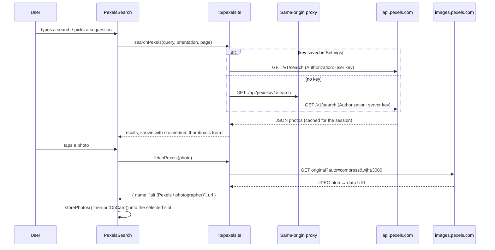

# Pexels integration

Chitthi can search [Pexels](https://www.pexels.com) for free photos from the **Photos** step and drop a result
straight into the selected photo slot. This document covers how the connection works, where the API key comes
from, and how to run it in each environment.

Code: `src/lib/pexels.ts` (API client, key storage, suggestions), `src/components/PexelsSearch.tsx` (search UI),
`src/components/SettingsDialog.tsx` (key entry), `vite.config.ts` (dev / preview proxy).

## The API key: never in the app

The key is **never compiled into the app bundle**. There are two ways the app gets access, checked in this order:

1. **The user's own key, entered in Settings.** Settings (gear icon in the header, on the home page, or
   **File → Settings** / `Ctrl+,` on desktop) has a key field with **Save and test**. The app makes one tiny search
   with the key; if Pexels accepts it, the key is saved in `localStorage` under `chitthi-pexels-key` on that device
   (in the browser, or in the desktop app's own storage). Requests then go straight from the device to
   `https://api.pexels.com` with the key in the `Authorization` header. **Remove key** deletes it.
2. **A server-side proxy.** With no saved key, the app calls `./api/pexels/v1/search` on its own origin. A server
   that has the key forwards the call to Pexels and adds the `Authorization` header on its side. The Vite dev and
   preview servers do this when `PEXELS_API_KEY` is set in `.env.local`. The variable has no `VITE_` prefix, so Vite
   never exposes it to the page.

If neither is available, the Photos step shows **Photo search needs a free Pexels API key** with an **Open settings**
button. Settings shows the current state: *Connected with your key*, *Connected through this server*, or *Not
connected*.

| Environment | Default access | What the user does |
| --- | --- | --- |
| `npm run dev`, `npm run preview` with `PEXELS_API_KEY` in `.env.local` | Server proxy | Nothing; a personal key in Settings overrides it |
| Docker / nginx build | None (no proxy shipped) | Paste a key in Settings, or add a proxy (below) |
| Desktop app (Windows, macOS) | None | Paste a key in Settings (**File → Settings**) |

Getting a key: sign in at pexels.com, open [pexels.com/api](https://www.pexels.com/api/) and request a key (free,
immediate). The default limit is 200 requests an hour and 20,000 a month per key.

## Request flow



Details:

- **Suggestions** (`pexelsSuggestions`) come from the design: the calendar month on screen (a seasonal idea per
  month), the occasion theme (for example *diwali diya lights*), then a few per product.
- **Shape filter** (`slotOrientation`): the selected photo slot of the current layout is measured; wider than 1.2:1
  searches `landscape`, narrower than 0.83:1 `portrait`, otherwise `square`. The user can switch to Wide, Tall,
  Square or Any.
- **Caching**: each (query, orientation, page) result is kept in memory for the session, so moving between steps
  or months doesn't spend requests. Saving or removing a key clears the cache.
- **Downloads**: the chosen photo is fetched at up to 3000 px on the long side (never upscaled) and turned into a
  data URL. From then on it behaves exactly like an upload: it goes into the photo store, works offline, and is
  saved with designs and backups.
- **Detecting a missing proxy**: a static host answers `./api/pexels/…` with a 404, or with `index.html` from its
  single-page-app fallback. Anything that isn't JSON counts as "no proxy". A 401 or 403 means the key was refused;
  429 means the hourly limit is used up.

## Browser security settings

Both hosts must be allowed by the Content Security Policy, which is already done:

- `nginx/security-headers.conf`: `img-src … https://images.pexels.com` and
  `connect-src … https://api.pexels.com https://images.pexels.com`.
- `electron/main.cjs` (`CSP`): the same two additions for the desktop app.

Both Pexels hosts send `Access-Control-Allow-Origin: *`, so the page can read the JSON and draw downloaded photos
on a canvas without tainting it. The service worker (`public/sw.js`) never caches anything under `/api/`.

## Adding a proxy to a production server (optional)

The Docker image doesn't ship a proxy, so each user brings their own key. To give everyone search through one
server key instead, add a location to `nginx/default.conf` and pass the key in at container start. For example,
with the nginx image's template support (`/etc/nginx/templates/*.template` is rendered with environment variables
at start-up):

```nginx
location /api/pexels/ {
    proxy_pass https://api.pexels.com/;
    proxy_set_header Authorization "${PEXELS_API_KEY}";
    proxy_set_header Host api.pexels.com;
    proxy_ssl_server_name on;
    limit_except GET { deny all; }
}
```

Keep in mind:

- Anyone who can reach the site can use your key's hourly allowance. Put the site behind a login or add
  `limit_req` if it's public.
- The compose file runs the container `read_only`. Template rendering writes to `/etc/nginx/conf.d`, so either
  render to the `/tmp` tmpfs (`NGINX_ENVSUBST_OUTPUT_DIR=/tmp/nginx` and include that directory) or mount the
  rendered config.
- Never put the key in a `VITE_*` variable: those are compiled into the JavaScript that every visitor downloads.

## Licence and attribution

Photos are free to use under the [Pexels license](https://www.pexels.com/license/), including in printed products.
Pexels asks apps to credit Pexels and photographers, so:

- The search panel always shows "Photos provided by Pexels" with links to Pexels and the licence.
- Each photo keeps its photographer in its name (`alt (Pexels / Photographer)`), which appears in the photo list and
  saved designs.
- Photos of identifiable people or brands can carry other rights; the licence doesn't cover implying endorsement.

## Troubleshooting

| Symptom | Cause | Fix |
| --- | --- | --- |
| "Photo search needs a free Pexels API key" | No saved key and no proxy | Settings → paste key → Save and test |
| "Pexels didn't accept that key" | Key mistyped or revoked | Copy it again from pexels.com/api |
| "The Pexels search limit for this hour is used up" | 200 requests/hour reached | Wait, or use another key |
| Dev server search fails although `.env.local` has a key | Server started before the key was added | Restart `npm run dev` |
| Thumbnails blank in a custom deployment | CSP without `images.pexels.com` | Use `nginx/security-headers.conf` as shipped |
| Search box missing from Photos | Turned off in Settings | Settings → *Show Pexels search in the Photos step* |
