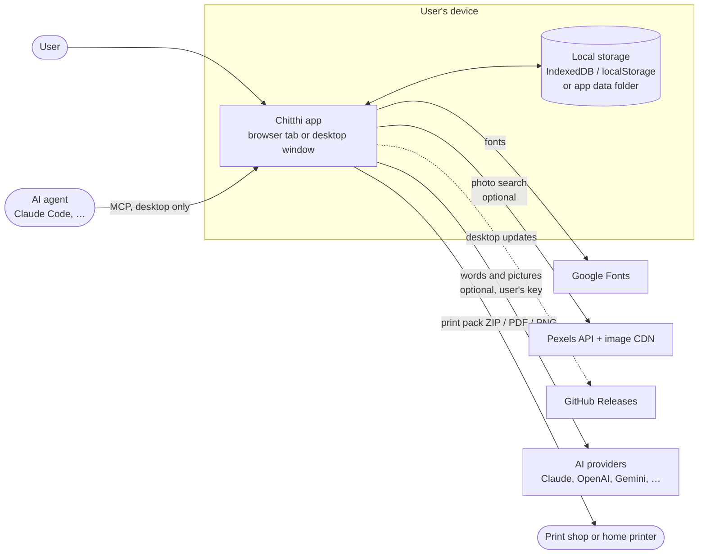
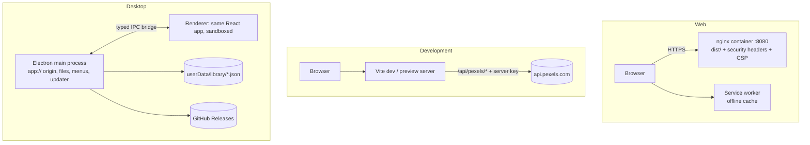
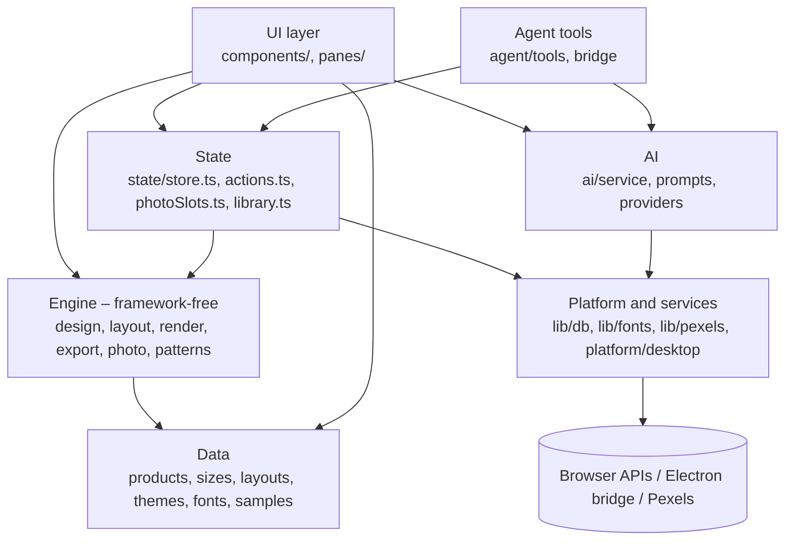

# Chitthi – Architecture (high-level design)

> How the system is organised and the contracts between its parts. Read before touching shared code or adding a
> module. Modules, data model and algorithms are in the [low-level design](lld.md); the conventions every change
> follows are in [§10](#10-conventions). Each feature's verify step updates this file (or `lld.md`) with what it
> established.

**Last updated:** 2026-10-06

## 1. Purpose and scope

Chitthi is a print studio for personal photo products: **postcards** (including Instax-style prints),
**calendars**, **photo-frame prints** and **fridge magnets**. Users add photos, pick a size and layout, apply an
Indian festival, birthday or season theme, write their words, and download print-ready files: PNGs and PDFs with
bleed and crop marks, plus a specification sheet for the print shop.

It ships as:

- a **web app**: static files served by nginx (Docker image) or any static host;
- a **desktop app** for Windows and macOS: the same web app inside Electron, fully offline, with native files and
  auto-updates.

Out of scope: accounts, cloud storage, ordering or payment, and server-side rendering. There is no Chitthi backend.

## 2. System context

- Photos never leave the device, except that Pexels photos are downloaded *to* it.
- The only outbound calls are fonts (web only), optional Pexels search, optional AI requests to the service the user
  chose with their own key ([AI.md](../docs/AI.md)), and update checks (desktop only).
- Agents connect only to the desktop app, over stdio or a loopback HTTP endpoint with a token ([MCP.md](../docs/MCP.md)).

## 3. Deployment views

| Target | Serves | Storage | Fonts | Pexels access |
| --- | --- | --- | --- | --- |
| Web (Docker/nginx) | `dist/` over HTTPS | Browser (IndexedDB, localStorage) | Google Fonts, cached by the service worker | User's key from Settings |
| Dev / preview | Vite | Browser | Google Fonts | Server proxy with `.env.local` key, or user's key |
| Desktop | `app://chitthi` from the packaged `dist/` | JSON files in the app data folder | Bundled `.woff2` | User's key from Settings |

## 4. Building blocks

| Block | Responsibility |
| --- | --- |
| **Data** (`src/data/`) | Declarative specifications: products, sizes, layouts, themes and wishes, fonts, gallery samples |
| **Engine** (`src/engine/`) | Pure drawing and file logic. Given a `Design` and photos it computes layouts, draws any face at any resolution, and builds PDFs, PNGs and the ZIP pack; the photo engine (light, curves, mixer, detail, LUTs, masks on a GPU render graph with a Canvas 2D fallback, the 16-bit render, RAW and TIFF) and the video engine. No React |
| **State** (`src/state/`) | One app store (design, photos, UI) with undo/redo and autosave; user actions such as adding photos, switching product, export and gallery |
| **UI** (`src/components/`) | Landing page, print studio (header, step rail, step panes in `panes/`, live stage), photo & video studio (`studio/`, `ig/`), AI dialogs (`ai/`), gallery, 3D viewer, crop tool, sizes guide, paper sizes in 3D, in-app docs, settings |
| **Platform and services** (`src/lib/`, `src/platform/`) | Storage abstraction (IndexedDB or desktop files), font loading, Pexels client, desktop bridge and menus |
| **AI** (`src/ai/`) | Facade over provider adapters: words and captions sized to the layout, slot-shaped pictures, prompt templates, keys, daily limits. On-device segmentation for AI masks (`segment/`: ONNX Runtime Web in a worker). Loaded only when used |
| **Agent tools** (`src/agent/`) | One registry of 56 tools (34 for print, 22 for the photo studio), plus MCP prompts and resources, that call the stores and engine; the page side of the MCP server |
| **Desktop shell** (`electron/`) | Window, `app://` protocol with CSP, file-based library, save/open dialogs, menus, file association, auto-update; the RAW developer (`raw.cjs` runs LibRaw's `dcraw_emu`, a separate program); bundled fonts and LibRaw fetched into `resources/` |

## 5. Key flows

**Designing.** Every edit updates the `Design` in the store. The stage canvas re-renders the current face with
`renderCard()` at screen resolution, and thumbnails redraw at low priority. After 400 ms of quiet the change becomes
an undo step and the design is saved to `localStorage`; photos go to IndexedDB (or disk) after 1.2 s.

**Exporting.** The same `renderCard()` draws each page at the chosen dpi with bleed. The export module places pages
in a PDF (one per page, or imposed many-up on a sheet with mirrored backs), writes PNGs with their dpi, and
packs everything with a `PRINT-SPEC.txt` into a ZIP. On desktop the file goes through a native Save dialog.

**Calendars.** One design yields up to 12 month pages plus a year-at-a-glance back. Each page moves on through the
photo list, and each month can have its own caption. The month strip, export and 3D ring all render the pages from
the same function.

**Photo library.** The **Photos** button in the header opens every photo on the device. Each is measured against the
selected slot of the current layout: its shape (how much a cover crop would cut away) and the print resolution it
reaches there, so "Fits this slot" shows only suitable photos. Upload, crop, take off and delete happen in place.

**Envelopes.** Every design has a matching envelope: the smallest standard envelope the piece fits, drawn from the
same occasion, fonts, greeting and photo. The print pack adds a print-on-envelope PDF, PNGs and a fold-your-own
template on the smallest sheet it fits; the 3D viewer shows it with an opening flap and the card sliding out.

**Custom fonts.** Uploaded TTF / OTF / WOFF fonts are stored on the device and registered with the FontFace API, so
they draw on the canvas and in print files like built-in families.

**Photo search.** The Photos step asks Pexels for photos that match the design (month, occasion, product) and the
shape of the selected slot. A chosen photo is downloaded, converted to a data URL and handled exactly like an
upload. See [PEXELS.md](../docs/PEXELS.md).

**Saving and sharing.** The gallery stores designs with photos and rendered thumbnails. Designs can be exported as
single `.chitthi` files or a whole-gallery JSON backup, and restored on another device or app.

**Desktop updates.** On start, the packaged app checks GitHub Releases through electron-updater and offers to
install newer versions. A `v*` tag pushed to GitHub builds and publishes both platforms ([build.md](build.md)).

## 6. Data and storage

| Data | Web | Desktop | Lifetime |
| --- | --- | --- | --- |
| Current design | `localStorage` `chitthi-v3` | same (app origin) | Until replaced |
| Last design per product | `localStorage` `chitthi-product-<id>` | same | Until replaced |
| Current card's photos | IndexedDB `chitthi` / `work` | `library/work.json` | Until replaced |
| Photo store (every upload) | IndexedDB `library` | `library/photos/<id>.json` | Until deleted |
| Gallery designs | IndexedDB `designs` | `library/designs/<id>.json` | Until deleted |
| Saved presets (photo & video editors) | IndexedDB `presets` | `library/presets/<id>.json` | Until deleted |
| Imported LUTs | IndexedDB `chitthi-luts` | same (app origin) | Until removed |
| Settings (Pexels key, search on/off, theme) | `localStorage` | same | Until changed |
| AI settings (services, models, limits, usage) | `localStorage` `chitthi-ai` | same | Until changed |
| AI keys | `localStorage` (or `sessionStorage` for this tab only) | `ai-keys.json` in the app data folder, encrypted with `safeStorage` | Until deleted in Settings |
| Agent output | — | `Documents/Chitthi agent output` | Until deleted |
| Uploaded fonts | IndexedDB `chitthi-fonts` (names also in `localStorage`) | same (IndexedDB in the app) | Until deleted in Settings |

Photos are stored as data URLs so designs, backups and `.chitthi` files are self-contained.

## 7. Security

- **No server-side user data.** Nothing is uploaded; there is nothing to breach centrally.
- **Content Security Policy** in both nginx and Electron: scripts only from the app itself; images and connections
  only to the app itself, Google Fonts and the two Pexels hosts; no frames, objects or form posts.
- **Desktop isolation**: the renderer is sandboxed without Node. It reaches the system only through the small
  `window.chitthiDesktop` bridge, and every IPC handler accepts calls only from the app's own page
  (`electron/ipc.cjs`). File ids are validated, and only files the session saved can be shown in the folder. Every
  browser permission is refused except fullscreen and writing to the clipboard. Reading a photo by path works only
  while an agent is connected.
- **Desktop binary**: Electron fuses are set at packaging (`electron-builder.yml`): `NODE_OPTIONS` and `--inspect`
  are ignored, and app code loads only from the integrity-checked `app.asar`. `RunAsNode` stays on because the MCP
  stdio relay needs it.
- **API keys**: no key is compiled into the bundle. A user's Pexels key stays on their device and is sent only to
  `api.pexels.com`. The dev proxy key stays in the Vite server process. AI keys are sent only to their provider's
  listed hosts (`electron/ai-hosts.json`); on desktop they are encrypted with the OS (`safeStorage`), used only by the
  main process, and never readable by the page. On the web they last for the tab unless the user chooses to remember
  them. A request carrying a key never follows a redirect, and on desktop local AI services must be on loopback.
- **MCP**: off unless started with `--mcp` or turned on in Settings; loopback only, random bearer token, browser
  origins refused, files written only to one output folder, overwrites need `confirm`.
- **Headers** (web): `X-Content-Type-Options`, `Referrer-Policy`, `X-Frame-Options`, `Permissions-Policy` and COOP.
  The container runs as non-root with a read-only file system. HSTS is set at the TLS proxy ([OPERATIONS.md](../docs/OPERATIONS.md)).
- **Supply chain**: dependencies, GitHub Actions (pinned by SHA) and Docker base images (pinned by digest) are kept
  current by Dependabot; CodeQL scans every pull request. Reporting a vulnerability: [SECURITY.md](../SECURITY.md).

## 8. Quality attributes

| Attribute | Approach |
| --- | --- |
| Print accuracy | All geometry in millimetres; rendering scales by pixels-per-mm, so preview and 300 dpi output share one code path. Bleed extends edge-touching photos; guides show trim and safe area |
| Offline | Service worker (web); everything bundled (desktop) |
| Performance | Lazy jsPDF; deferred thumbnail redraws; per-session caches for sample renders and Pexels results; photos pre-processed once (crop, rotate, look) |
| Memory | Explicit budgets: 16 MP per photo, undo history capped at 320 MB of extra photo canvases, caches limited or dropped after use, AI and agent images size-capped. A built-in performance monitor shows CPU (desktop), main-thread load, memory and photo memory ([PERFORMANCE.md](../docs/PERFORMANCE.md)) |
| Responsive UI | One layout from 1920 px to 360 px with no sideways scrolling: secondary header actions fold into a More / Menu list instead of wrapping ([LLD §8](lld.md#8-components))
| Accessibility | Keyboard-operable stage (arrow keys and zoom), labelled controls, live regions, WCAG AA contrast in both themes, reduced-motion support |
| Maintainability | Specifications as data ([SPECIFICATIONS.md](../docs/SPECIFICATIONS.md)); engine free of UI code; strict TypeScript with exhaustive `Record<ProductId, …>` maps |
| Portability | One build for web and desktop; platform differences are behind `lib/db.ts` and `platform/desktop.ts` |

## 9. Main design decisions

| Decision | Reason | Trade-off |
| --- | --- | --- |
| No backend | Privacy, zero running cost, works offline | No sync between devices (backups and `.chitthi` files instead) |
| Canvas renderer for preview and print | Pixel-identical output at any dpi | Text layout implemented by hand (wrapping, fitting) |
| Data URLs for photos | Self-contained designs and backups | Larger storage use than blobs |
| Electron wrapping the web build | One code base for three platforms | Large installers (~120 MB) |
| Pexels key from Settings, optional proxy | Key never ships in the bundle; each deployment chooses | Users of a proxy-less build must get their own key |
| AI with the user's own key, no AI backend | No running cost or data custody; any provider | Users need an account; some providers work only on desktop (no CORS) |
| Provider adapters behind a registry, loaded with `import()` | Adding a provider is one file and one line; nothing loads until used | A small indirection per call |
| Desktop AI calls in the main process | Keys never reach the page; no CORS limits | IPC copies of image bytes (capped at 40 MB) |
| One tool registry for agents, running in the page | Agents use exactly the studio's code; live mode shows every change with undo | Headless mode needs a hidden window |
| MCP over loopback HTTP plus a stdio relay | Electron's main process can't read stdin on Windows; one server serves both modes | An extra small process in headless mode |

## 10. Conventions

Every change follows these; [CLAUDE.md](../CLAUDE.md) → *Things that bite* has the detail.

- **Layers.** Specifications are data in `src/data/` (add sizes, layouts, products and themes there, not in rendering
  code). `src/engine/` never imports React. State lives in small `useSyncExternalStore` stores in `src/state/`, each
  with its own undo/redo (same-key changes within ~800 ms coalesce). UI is in `src/components/`; screens and dialogs
  are `lazy()`-loaded.
- **One code path for preview and export.** Print: `render.ts`; photo: the GPU graph with Canvas 2D fallback; video:
  `renderFrame()`. Never fork an export-only renderer.
- **One validator per external format.** Loaded designs go through `mergeDesign()`; photo edits, presets and masks have
  their own gate (`mergeEdit`, `mergeAdjust`, `mergeMasks`, `mergePreset` …). New external formats get one too.
- **Web vs desktop.** Branch on `desktop` / `isDesktop` from `src/platform/desktop.ts`. Every IPC handler is
  registered with `handle` / `on` from `electron/ipc.cjs` and validates its arguments. New `electron/` files go in
  `files:` in `electron-builder.yml`.
- **Bundle.** Heavy or optional code (AI providers, Mediabunny, jsPDF, ONNX Runtime) loads with `import()`; the
  entry chunk stays ≤ 350 KB with no AI code (`scripts/check-bundle.mjs`).
- **CSP.** New hosts, `blob:` workers or media are added in both `nginx/security-headers.conf` and the Electron CSP in
  `electron/main.cjs`.
- **Errors.** Caught-and-shown failures call `logError('handled', e)` (`src/lib/errors.ts`).
- **Styles.** Numbered files imported in cascade order from `src/styles.css`; new ones go at the end. Media studio UI
  uses the root class `.mst`, never `.ig`.
- **Agents.** Every user-facing feature is reachable through a tool in `src/agent/tools.ts`, documented in
  [docs/MCP.md](../docs/MCP.md).
