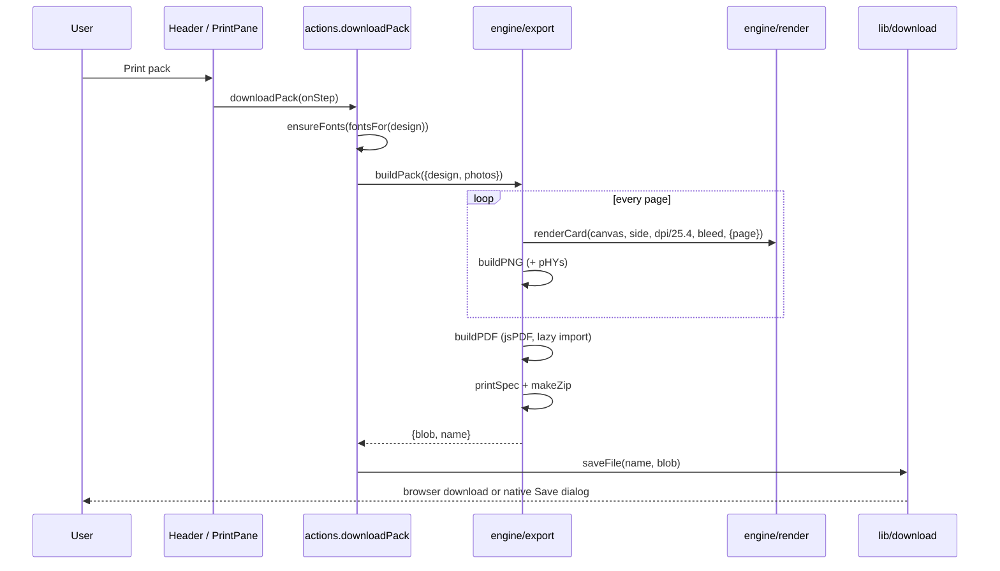

# Chitthi – Low-level design

This document describes the modules, data model and algorithms behind the [high-level design](architecture.md). Paths
are relative to the repository root.

## 1. Module map

```text
src/
  main.tsx                 Entry: applies the saved theme, loads bundled UI fonts on desktop, mounts <App>, registers the service worker
  App.tsx                  Screens (home / studio / sizes / paper / instagram / docs), hash routing, start-up effects,
                           keyboard shortcuts
  index.ts                 Library entry for the design-system sync (re-exports; never mounts)
  types.ts                 Every shared type: Design, Photo, Layout, SizeDef, CalendarSettings, …
  vite-env.d.ts            Type references: Vite client, @webgpu/types
  assets/                  fonts/: the Schibsted Grotesk UI font (WOFF2, Latin and Latin Extended), bundled by Vite
  assests/                 Unused Pexels photos (Images/postcards/), nothing imports them (000 Known gaps)
  data/                    Specifications as data
    products.ts              PRODUCTS, productOf, sizesFor, MONTHS
    sizes.ts                 SIZES, SIZE_GROUPS, sizeLabel
    layouts.ts               LAYOUTS (id, name, product), LOOKS
    themes.ts                25 occasion themes: colours, patterns, fonts, greetings, quotes
    fonts.ts                 46 font families with category and weights
    samples.ts               Gallery samples built from Pexels photos in public/samples/
    showcase.ts, .json       Landing page examples (definitions) and their pre-rendered images (manifest)
    printSamples.ts          The 12 print samples for test prints and quotes (npm run build:print-samples)
    docs.ts                  The in-app documentation (#/docs) as pages of blocks, rendered by DocsPage.tsx
    instagram.ts             Instagram post formats and limits
    layers.ts                Layer shapes, stickers, text styles, brushes and palette for photos and video
    presets.ts               Built-in presets of the photo & video editors (looks)
  engine/                  Framework-free; no React imports
    design.ts                DEFAULT_DESIGN, productDesign, mergeDesign, cardMM, calPages, cornerMM, resolveTheme, inks
    layout.ts                computeLayout, slotCount, slotPhotoIndex
    render.ts                renderCard and every drawing routine (fronts, backs, calendars, badge, guides)
    patterns.ts              Procedural occasion artwork (PAT)
    photo.ts                 File checks, loading, makePhoto / updatePhoto (crop, rotate, looks), lookPixels
    instagram.ts             Instagram posts: placement, colour adjustments, renderIg (docs/MEDIA-STUDIO.md)
    adjust.ts                A photo's or clip's colour settings as parameters (never pixels), kept apart from framing
    light.ts                 Light and white balance in linear light: temperature, tint, exposure, tones (P1.1)
    curve.ts, hsl.ts         Tone curve (monotone spline, per channel) and colour mixer (8 bands) (P1.2)
    chain.ts                 The Canvas 2D colour chain: look → light → curve → mixer → LUT, one rounding at the end
    detail.ts                Noise reduction, dehaze, clarity, sharpening, grain, sized for a 1080 px frame (P1.3)
    lut.ts                   .cube parser, tetrahedral lookup, LUTs loaded this session (gpu/lut.ts on the GPU)
    presets.ts               Saved presets: mergePreset, names, the preset file (presets plus their LUTs)
    masks.ts                 Masks: model, mergeMasks, brush / gradient / range rasters (cached), handles, frameMask
    segments.ts              AI segmentation maps (subject, sky) per picture source, for AI mask parts (P1.8)
    photoExport.ts           Photo file types (JPEG, PNG, WebP, AVIF): which this browser writes, encodePhoto
    raw.ts, tiff.ts          Camera RAW: developed pixels → preview and linear source; 16-bit TIFF writer (P1.9)
    deep.ts                  The 16-bit float render behind the TIFF export (P1.9)
    gpu/                     The GPU render graph (P0.2–P0.5, P1.3–P1.6), with the Canvas 2D path as fallback:
                             types.ts (device contract), device.ts (WebGPU, else WebGL2, else none), webgpu.ts,
                             webgl2.ts, graph.ts (nodes, runNodes), colour.ts, detail.ts, lut.ts, mask.ts (programs
                             mirroring the CPU code), apply.ts (the GPU step of renderIg)
    layers.ts                Text, shapes, stickers, drawings, images over photos and video: draw (blend, mask), pick, handles
    video.ts                 Video timeline and frame drawing (renderFrame), formats, per-platform limits
    videoExport.ts           MP4 export (H.264 + AAC, fast start) with Mediabunny, loaded on export
    export.ts                pagesOf, nup, buildPDF, buildPNG, printSpec, buildPack, envelope PDFs
    envelope.ts              Envelope size, front / back / 3D layers, fold-your-own template
    color.ts, sample.ts      Colour maths and drawing helpers; painted stand-in photos
  state/
    store.ts                 App store, undo/redo, persistence, setters
    actions.ts               User actions (photos, products, export, gallery, backup, 3D)
    photoSlots.ts            Photo ↔ slot mapping, slot selection
    library.ts               Photo store (every upload), putOnCard
    photoFit.ts              Photo shape vs slot shape, crop loss, print dpi in a slot, learned pixel sizes
    instagram.ts             Instagram studio batch: photos, edits, layers, undo, limit, render, ZIP, share check
    presets.ts               Saved presets of the photo & video editors: list, save, rename, delete, export, import
    video.ts                 Video editor: clips, layers, music, playhead, undo, export
  lib/
    db.ts                    Storage API: IndexedDB in browsers, IPC to files on desktop
    fonts.ts                 On-demand font loading (Google Fonts or bundled)
    pexels.ts                Pexels client, key and settings storage, suggestions
    userFonts.ts             Uploaded fonts: IndexedDB storage, FontFace registration
    userLuts.ts              Imported .cube LUTs: IndexedDB storage, loaded into engine/lut.ts when chosen
    fileSink.ts              A file the video export streams into (desktop IPC or the File System Access API)
    gpuSetting.ts            The "use the graphics card" setting, kept on this device (P0.5, P0.9)
    perf.ts                  Performance monitor sampler (CPU / load, frames, memory, photos, storage) and report
    errors.ts                In-memory log of recent errors (uncaught, rejections, render, handled) for the reports;
                             components/ErrorBoundary.tsx shows the error screen
    download.ts, zip.ts, toast.ts, theme.ts
  ai/                      Loaded with import() only when an AI feature is used (section 5, AI)
    types.ts                 TextAdapter, ImageAdapter, requests, AiError, aspect helpers
    registry.ts              Provider id → lazy adapter module; request context per call
    service.ts               Facade: writeWords, writeCaptions, writeMessages, generateArt, textBudget, slotShape
    transport.ts             Adds the key for allowed hosts (web) or sends the request to the main process (desktop)
    secrets.ts, settings.ts  Keys (SecretStore); chosen services, models, daily limits and usage
    prompts/                 Versioned templates: words.ts (greetings, captions, messages), artwork.ts (pictures)
    providers/               anthropic, openai, gemini, openaiCompat, stability, fal, bfl, replicate, ideogram
    segment/                 AI masks (P1.8): index.ts (models on the device, download + SHA-256 check, segmentPhoto),
                             models.ts (the two models), worker.ts (ONNX Runtime Web), models/u2netp.onnx
  agent/
    tools.ts                 The 56 agent tools: JSON Schema input and a handler each (34 for print designs here)
    photoTools.ts            The 22 photo studio tools: batch, framing, colour, masks (AI too), presets, LUTs, preview, export
    common.ts                Tool shape, schema helpers, reading an image by path or URL
    prompts.ts               MCP prompts (workflows) and resources (design, specs, photo rules)
    bridge.ts                Page side of MCP: runs one call at a time, returns text, images and files
  platform/
    desktop.ts               Typed window.chitthiDesktop bridge (absent in browsers)
    menu.ts                  Desktop menu commands → actions
  dev/                     Development only, never in production builds
    selftest.ts              The checks behind npm test (opened at ?selftest in Electron)
    showcase.ts              Renders the landing examples for npm run build:showcase
    printSamples.ts          Renders the print samples for npm run build:print-samples
  components/              React UI (section 8); studio/ = the photo & video studio workspace (Shell, PhotoWorkspace,
                           VideoWorkspace, Timeline, Dialog), ig/ = editing panels shared by photos and video (layers,
                           masks, curves, colour mixer, looks), panes/ = the print studio's step panes, ai/ = AI
                           settings, words and artwork dialogs
  styles.css               Ordered @imports of styles/ (section 8, Styles)
  styles/                  The stylesheet split by feature: 01-base.css … 40-site-nav.css, in cascade order
electron/
  main.cjs                 Main process: window, app:// protocol + CSP, file library, dialogs, menus, updater
  preload.cjs              contextBridge: the only system access for the page
  ipc.cjs                  handle / on: IPC registration that accepts only the app's own page
  ai.cjs, ai-hosts.json    AI requests with encrypted keys; allowed hosts and auth header per provider
  mcp.cjs                  MCP server (official SDK): loopback HTTP, headless start, agent IPC
  mcp-stdio.cjs            stdio ↔ HTTP relay run by the Electron binary in Node mode (headless)
  raw.cjs                  RAW photos: develops the page's bytes with LibRaw's dcraw_emu to 16-bit linear RGB (P1.9)
  dev.mjs                  Runs Vite + Electron together for development
  resources/               Not in git, fetched before packaging: fonts/ (npm run fetch:fonts) and
                           libraw/<platform>-<arch>/ (npm run fetch:libraw)
scripts/                   Build, test and fetch scripts (specs/build.md): check-bundle, check-licenses, test, mcp-smoke,
                           fetch-* (samples, fonts, LibRaw), build-* (showcase, print samples, favicons), spec-tables
```

Dependency rule: `components → state → engine → data`. `engine` never imports from `state` or `components`, so it
can render and export in any context: preview, thumbnails, gallery samples or the sizes guide.

## 2. Data model

### Design (`src/types.ts`)

The complete, serialisable description of one piece. It is saved as JSON in `localStorage`, the gallery, backups
and `.chitthi` files.

| Group | Fields |
| --- | --- |
| Product and size | `product: 'postcard'｜'calendar'｜'frame'｜'magnet'`, `sizeId`, `custom {w,h}` (mm), `orient` |
| Look | `useOccasion`, `themeId`, `group`, `artwork`, `decor`, `plain {bg, ink, accent, gradient}`, `frame` (paper / mat / border colour), `mat` (frame prints) |
| Layout | `layout: LayoutId` |
| Words | `heading`, `quote`, `sig`, `show*` flags, `insta`, `headFont`, `quoteFont`, `sigFont`, `instaFont`, `textScale`, `vAlign`, `hAlign`, `customColor`, `color`, `scrim`, `ornament` |
| Back | `back {message, font, fromFont, addrFont, labelFont, from, to, address, pin, stamp, label, tint, credit, date}` |
| Postmark | `postYear` (0 = automatic: the calendar's year, else this year; `postmarkYear(d)`) |
| Calendar | `cal {year, start, months: 1｜12, weekStart, text: 'off'｜'caption'｜'photo', captions[12], titleAlign, numbers, grid: 'lines'｜'boxes'｜'tiles'｜'none', font, numFont, numBold, numSync, titleScale, numScale, showYear, sundays, capFont, titleFont, backQuote, marks: 'off'｜'national'｜'all', markNames, ownDates[{m, d, label}]}` |

**Optional fonts** (`sigFont`, `instaFont`, `back.fromFont / addrFont / labelFont`, `cal.capFont / titleFont / numFont`)
are empty strings that mean "follow the parent font": the signature follows the quote font, From and address follow
the message font, labels and the tag use Hind, captions follow the greeting font, and the year-page title follows the
month font. A picker writes `''` back when the parent font is chosen, so the field keeps following it. With
`cal.numSync` the dates use the month font, and `numFont` is kept for when it is turned off.
| Export | `exp {format: 'pdf'｜'sheet'｜'png', sheet, bleed, dpi, quality, marks, back, pngs}` |
| Meta | `designName` |

`mergeDesign(saved)` makes any stored object safe: it starts from `DEFAULT_DESIGN`, keeps only known keys,
deep-merges nested groups, pads `cal.captions` to 12, and resets a size, layout or font that no longer exists for
the product. Optional fonts whose family is gone (an uploaded font removed from the device) fall back to `''`.
Every load goes through it, so old saves keep working, and new fields (calendar sizes, font sync, the year and
Sunday switches) take their defaults.

### Photo

`PhotoMeta` (serialisable): `name, url (data URL), rot, flip, crop {x,y,w,h} (0–1), zoom, px, py (−1…1), look`.
`Photo` adds runtime fields: `id`, `orig` (the decoded image), and `src / sw / sh` (the processed source).

### Specifications

`SizeDef {id, grp, products?, name, L, S (mm), inch?, tag?, instax?, native?, corner?, shape?}` and
`ProductDef {id, name, short, blurb, backLabel, paper, defaults}`. See [SPECIFICATIONS.md](../docs/SPECIFICATIONS.md).

### Layout (result of `computeLayout`)

| Field | Meaning |
| --- | --- |
| `slots: Slot[]` | Photo windows: `{x,y,w,h}` plus `s` shape (`rect｜round｜circle｜arch｜poly`), `bleed`, `bare` (no accent outline), and `d`, the drawing rect extended into the bleed when the slot touches the trim edge |
| `text: Rect｜null` | Zone for greeting / quote / signature; `onPhoto` makes it white with a shadow |
| `ink` | `'frame'` (the paper's ink), `'dark'` (the theme's darkest ink, on a light glass panel), or the default |
| `textFill?`, `textScaled?` | Text height as a share of the zone height (default 0.32; calendar caption bands use 0.72). `textScaled` means the zone was already sized with `textScale`, so the words aren't scaled twice |
| `glass?` | A frosted-glass panel over the photo (`glass`, `cal-glass`) |
| `bg`, `frame`, `paper`, `band`, `overlay`, `frameLine`, `mat` | What is painted behind and around the photos |
| `stamp`, `post` | Postage-stamp layout pieces |
| `calTitle`, `calGrid`, `calYear`, `calNum` | Calendar month title, day grid, the 12-month grid of the Year strip, or the big month number (`cal-bold`) |
| `scrimArea?` | Limits "darken the photo" to the photo (calendars) |
| `arc?` | Badge magnet ring for curved lettering |

## 3. State (`src/state/store.ts`)

```ts
interface AppState { design: Design; photos: Photo[]; ui: UIState; designId: string | null; canUndo; canRedo }
interface UIState  { side, guides, pane, cropId, slot, viewer, gallery, settings, screen: 'home'|'studio'|'sizes'|'paper', calPage, fontTick }
```

- A module-level object plus a listener set. Components subscribe with `useApp(selector)`, built on
  `useSyncExternalStore`. Selectors must return stable references or primitives.
- `set(patch, track)`: tracked changes (design or photos) schedule **persistence** and **history**; UI changes
  (`setUI`) do not.
- **History**: `scheduleCommit()` debounces for 400 ms, then `commit()` pushes `{design, photos}` (a stack of up to
  100). Undo and redo restore snapshots by reference. Photo objects are immutable, so snapshots are cheap.
- **Persistence**: design → `localStorage['chitthi-v3']` after 400 ms. Photos → `db.putWorkPhotos` after 1.2 s, only
  when a signature (names, URL lengths, edits) changed.
- Setters: `setDesign(patch | fn)`, `setBack`, `setExp`, `setPlain`, `setPhotos`, `patchPhoto`, `setUI`,
  `replaceCard`.
- Routing helpers: `screenOf(hash)` / `hashOf(screen)` map `#/studio`, `#/sizes`, `#/paper` and home.

### Actions (`src/state/actions.ts`)

| Action | What it does |
| --- | --- |
| `addFiles(files)` | `checkFile` → data URL → `makePhoto`; fills up to `maxPhotos(product)`; every good file also goes to the photo store; returns user messages |
| `selectSize(s)` | Sets the size; Instax sizes also force the Instax layout and an A4 sheet without bleed |
| `switchProduct(p)` | Saves the current design under `chitthi-product-<old>`, restores or creates the other product's design, keeps photos |
| `downloadPack / downloadPrintFile / downloadPNG` | Ensure fonts, run the export engine, `saveFile` (browser download or native dialog) |
| `open3D()` | Renders front, back and (calendars) every month page to JPEG data URLs → `ui.viewer` |
| `saveDesign / openDesign / newCard` | Gallery record with photo metas and 900 px thumbnails |
| `exportBackup / exportDesignFile / importText` | JSON gallery backup, single `.chitthi` file, validated import |
| `restoreWork()` | On start, reloads the previous card's photos |
| `openSample()` | Loads a gallery sample into the studio |

### Photos and slots (`photoSlots.ts`, `library.ts`)

The **order of `photos` is the assignment**: slot `i` on page `p` shows `photos[slotPhotoIndex(i, n, p, count)]`,
which is `(p × count + i) mod n`. Calendars therefore move through the list month by month. Placing a photo in a
slot swaps two list positions, so undo, autosave and export need no extra state. `putOnCard(storedPhoto)` adds a
stored or downloaded photo: move it if it's already on the card, fill an empty slot, add it, or replace the photo
in the selected slot when the card is full.

## 4. Engine

### 4.1 Geometry (`design.ts`, `layout.ts`)

- `cardMM(d)` gives the trim size in mm for the orientation (custom sizes are clamped by the UI to 40–420 mm).
- `renderCard(canvas, side, pxPerMM, bleedMM, input, opts)` sizes the canvas to `(w + 2·bleed) × (h + 2·bleed) ×
  pxPerMM` and defines the box `B = {x: e, y: e, w, h, e}` in canvas pixels, where `e` is the bleed in pixels.
- `computeLayout(id, B, d)` returns a `Layout` in the same pixel space. Shared metrics: `m = min(w, h)`,
  `pad = 0.075m`, `gap = 0.016m`, `u = m/100`. Because every value is relative to the box, one layout works at any
  size and dpi. Helpers: `rs()` makes a bleed slot, `plain()` an inset slot, `right()` / `below()` the text zone
  beside or under a photo. At the end, slots touching the trim are extended into the bleed (`extend()`).
- **Calendars**: each calendar layout defines a photo region and an *area*. When `cal.text` is `photo`, the text
  zone is the photo inset by 8%, with white ink and the scrim limited to the photo. When it is `caption`, a band
  of `min(0.1·area.h, 0.075·area.w) × textScale` is taken from the top of the area. The title band is
  `min(0.17·area.h, 0.12·area.w) × cal.titleScale` (both scales clamped to 0.5–1.8). Caption and title share at most
  46% of the area and shrink together beyond that, so the grid always keeps the rest. For the **Year strip** it
  splits into a year title and `calYear`. **Big number** (`cal-bold`) splits the title row into `calNum` (the
  number, 1.5 × its height wide) and a title box sized so the month name's baseline meets the number's.
  **Frosted glass** (`cal-glass`) puts the area on a `glass` panel with `ink: 'dark'`; **Arch window** (`cal-arch`)
  uses an arch slot above (or beside) it.
- **Badge magnet**: a circular photo of radius `r − band` inside a ring; `arc` describes the ring for lettering.

### 4.2 Rendering (`render.ts`)

`drawFront` runs in this order:

1. Background: paper colour (`frame` layouts), occasion gradient and patterns (`bg`), or nothing (full-bleed).
2. Paper card and stamp shapes.
3. Photo slots: `drawSlot` clips to the slot shape and draws the photo with **cover** scaling
   (`max(w/sw, h/sh) × zoom`), offset by `px, py`. Empty slots show a hatched "Add a photo" hint in the preview.
4. Mat bevels (frames), stamp text and postmark, frosted glass (`drawGlass`: the photo under the panel drawn at
   1/28 size and scaled back up, which blurs it in every browser, then lightened), calendar band, occasion overlay
   decoration, frame line.
5. Words: `drawText` lays out heading / ornament / quote / signature (`layoutText` + `wrapLines`). It starts at
   `min(Z.w × (0.13 + 0.06·tall), Z.h × textFill) × textScale` (`tall` grows from 0 to 1 as the zone goes from
   0.8 to 2 times taller than wide, so narrow columns wrap the greeting instead of shrinking it) and shrinks by 7%
   until everything fits the zone, then aligns with `vAlign` / `hAlign`. On a calendar, `calendarWords()`
   substitutes that month's caption for the greeting, in `cal.capFont`, aligned with the month title when it sits
   above the month.
6. Calendar month (`drawMonth`), Year strip (`drawYearTitle` + `drawYearGrid`), badge lettering (`drawBadge`),
   Instagram tag.

Backs: `drawBack` (postal back), `drawYearBack` (calendar), `drawFrameBack` (dedication label), `drawMagnetBack`.
Round sizes are then masked white outside the trim circle plus bleed. `drawGuides` draws trim (red) and safe area
(blue, 4 mm) as rectangles or circles.

**Calendar typography** (the rules that keep pages consistent):

- *Month title*: font size is the largest at which the **widest** of the twelve month names, plus the year, fits
  the title box. Every page gets the same size. The baseline is centred on the font's cap height, and the year sits
  on the same baseline in the accent colour. A left-aligned title is inset to match the first column's numbers.
- *Grid*: always **five rows** on month pages. A sixth week shares the cell above it, drawn smaller and split by a
  diagonal ("23/30"). The grid lines and number positions are therefore identical every month.
- *Numbers* in the cell corner (padding 13% of the cell) or centred, scaled by `cal.numScale` and capped to the
  cell. Sundays use the accent colour unless `cal.sundays` is off. Weekday headers are letter-spaced capitals
  aligned the same way as the numbers. The dates font is `numFont` (Hind when empty), or the month font with
  `numSync`. The **Tiles** grid draws a rounded, lightly tinted square behind each date instead of rules.
- *Accent on paper*: a pale accent (lightness above 0.6) is deepened towards the ink for the year, Sundays and the
  big number, so yellow themes stay readable on white.
- *Month number* (`cal-bold`): the cap height fills `calNum`, sized on "00" so every month matches.
- *Marked days*: `marksFor(year, month, cal.marks, cal.ownDates)` (`data/holidays.ts`) gives each day's national
  days, festivals and own dates. National days and festivals colour the date like a Sunday; `drawMarks` writes the
  names along the bottom of the cell (two lines when the cell is tall enough, cut short with "…", "+N" for more), or
  one dot per kind in the year grid, in shared "23/30" cells and when `markNames` is off. `mergeDesign` turns marks
  off for calendars saved before the feature, so their look doesn't change.
- *Year grid* (back page, Year strip): 3, 4 or 6 columns by aspect ratio, with month names sized to the widest name.

### 4.3 Photos (`photo.ts`)

`checkFile` rejects HEIC, TIFF, GIF, BMP, SVG, PDF, empty files and files over 25 MB, each with its own message.
`makePhoto` stores the metadata and runs `processed()`: rotation, mirroring, crop and the colour look are applied
once at full resolution (capped at 16 MP for mobile canvas limits) into an off-screen canvas. `updatePhoto`
re-processes only when rotation, mirroring, crop or look changed; zoom and position are applied at draw time.

### 4.4 Export (`export.ts`)

- `pagesOf(d)`: one front (or one per calendar month, one for the Year strip), plus the back when `exp.back` is on
  and the product prints one (magnets don't).
- `cardCanvas(page)`: `renderCard` at `dpi / 25.4` px per mm with the chosen bleed.
- **Print PDF**: one page per side, page size = trim + bleed + a 9 mm slug when crop marks are on. Marks are drawn
  as vectors, with a label line.
- **Sheet PDF**: `nup(d)` tries both rotations on the sheet (8 mm margins, 10 mm gap with marks, 4 mm without) and
  keeps the one that fits more. Backs are placed in mirrored columns and rotated the other way, for long-edge duplex.
- **PNG**: canvas → PNG, then a `pHYs` chunk is inserted so the file reports its dpi.
- **Pack**: PNGs in `front/` and `back/`, the PDF, and `PRINT-SPEC.txt` (`printSpec`), zipped by `lib/zip.ts`
  (stored, CRC-32).



### 4.5 Envelopes (`envelope.ts`)

- `envelopeSpec(d)`: the smallest standard envelope with at least 5 mm room around the piece; square pieces get
  square envelopes; bigger pieces get a made-to-measure size.
- `renderEnvelope(canvas, face, pxPerMM, input)` draws at envelope size, without bleed (ready-made envelopes print to
  a margin). `front`: occasion band, return address (`back.from` + `env.sender`), stamp box, recipient (`back.to`,
  `back.address`) with PIN boxes, the greeting. `back`: paper, pocket seams, the flap in the occasion artwork and a
  scalloped seal holding the first photo or a monogram, and the Chitthi logo stamp (`drawChitthiMark`) with "Made with Chitthi" at the bottom centre as the product mark. `body`, `flap` and `liner` are the separate layers the 3D
  view animates.
- `renderEnvelopeTemplate()` lays the flat net on the smallest sheet it fits (A4, Letter, A3, 13×19 in, either way
  round): the address front in the centre; side flaps, bottom flap and closing flap around it. Flaps fold behind the
  front, so the closing flap's artwork is drawn **rotated 180°** about the top fold and reads correctly once folded.
  Solid lines are cuts, dashed lines folds, with 2 mm of paper colour bleeding past each cut.
- Export: `buildPack` adds `envelope/…-envelope-front.png`, `-back.png`, `-envelope-print.pdf` and
  `-envelope-template-<sheet>.pdf` when `design.env.on`.

### 4.6 Photo analysis and arrangement (`engine/analyze.ts`, `state/traits.ts`)

`analyzeImage()` reads a ≤ 96 px copy of a photo: mean luminance (brightness), its spread (contrast), colourfulness,
warmth (red − blue), the dominant hue (chroma-weighted histogram over nine named hues), a three-colour palette
(4-level colour boxes), sharpness (mean Laplacian edge energy) and a focus point (the centre of edge energy and
colour, weighted towards the middle). It also derives plain search tags (*bright, dark, colourful, muted, warm,
cool, sharp, soft, sky, night, black and white, wide / tall / square* and the hue).

- `relevance(traits, slot, theme)`: 0.45 × shape fit (crop loss) + 0.25 × print resolution in the slot + 0.12 ×
  sharpness + 0.18 × palette harmony with the occasion colours.
- `focusPosition(traits, aspect)`: the crop offset (px, py) that keeps the focus point in view.
- `assign(photos, slots)`: best total relevance; exhaustive for ≤ 6 slots and ≤ 8 photos, otherwise greedy by best
  pair.
- `state/traits.ts` caches traits by URL, analyses library photos in idle time one at a time, and stores the result
  on the stored photo (`StoredPhoto.traits`) so each is analysed once. `autoArrange()` reorders the card's photos by
  `assign` and sets each crop with `focusPosition` (calendars keep month order); `smartFill()` adds the most relevant
  library photos to empty slots. The photo strip shows at most 8 card and 8 library photos (most relevant first) and
  "All photos" to open the library.

The photo dock under the preview (`PhotoTray.tsx`) shows the layout's slots, then up to ten suggestions for the
selected slot (the design's unused photos, then the most relevant library photos, never duplicating a slot), then
tools. Slots accept drag and drop: a suggestion onto a slot places it; a slot onto another swaps them.

### 4.7 Print quotes (`data/printSpecs.ts`, `engine/quote.ts`)

`PRINT_SPECS` holds material, weight, finish, colour sides and finishing per category. `buildQuoteCatalog()` and
`buildQuoteRequest()` write A4 PDFs with jsPDF (a small writer with wrapping tables that break across pages, image
rows and fill-in lines); `buildPack` adds the request to every print pack and `printSpec()` lists the same details.

### 4.8 Photo fit (`state/photoFit.ts`)

`slotInfo(design, slot)` measures a slot at trim size. `cropLoss(w, h, aspect)` is the share of a photo a cover crop
removes (`1 − min(r, 1/r)`, where r is the photo aspect divided by the slot aspect); a photo *fits* when that is at
most 20%. `slotDpi` is the resolution a photo reaches covering the slot. Pixel sizes of stored photos are learned
from their thumbnails (`rememberDims`) and cached for the session, so filtering needs no extra decoding.

## 5. Integrations

### Fonts (`lib/fonts.ts`)

`ensureFont(name)` adds the family's stylesheet link (Google Fonts, or `app://chitthi/fonts/<slug>.css` on desktop
builds with bundled fonts) and waits for `document.fonts.load` of each weight. `fontsFor(design)` lists the heading,
quote, back and calendar month fonts. The app bumps `ui.fontTick` when fonts arrive, so canvases redraw.

### Uploaded fonts (`lib/userFonts.ts`)

`addUserFont(file)` checks the type (TTF, OTF, WOFF, WOFF2) and size (10 MB), test-loads it with `FontFace`, stores
`{family, file, data}` in IndexedDB `chitthi-fonts`, registers it with `document.fonts`, and adds a `FontDef`
(category `own`) to `USER_FONTS` in `data/fonts.ts`. The family name comes from the file name. The list of names is
mirrored in `localStorage`, so `mergeDesign` keeps a design's uploaded font at start-up before the files load;
`ensureFont` waits for `loadUserFonts()` for those names. Font pickers list them under **Your fonts** with an
upload button; Settings lists, previews and deletes them.

### Pexels (`lib/pexels.ts`)

| Function | Purpose |
| --- | --- |
| `pexelsKey()` / `setPexelsKey()` | The user's key in `localStorage['chitthi-pexels-key']`; changing it clears the cache and fires `chitthi:pexels` |
| `pexelsHidden()` / `setPexelsHidden()` | "Show Pexels search" setting |
| `testPexelsKey(key)` | One `per_page=1` search: `ok｜refused｜limit｜offline` |
| `pexelsAccess()` | `key` (saved key), `server` (same-origin proxy answers JSON) or `none` |
| `searchPexels(q, orientation, page)` | Saved key → api.pexels.com; else `./api/pexels/`. Results cached per request. Throws `PexelsKeyError` when there is no access |
| `fetchPexels(photo)` | Downloads up to 3000 px, returns `{name, url: dataURL}` |
| `pexelsSuggestions(d, page)`, `slotOrientation(d, slot)` | Queries and shape filter from the design |

Full description: [PEXELS.md](../docs/PEXELS.md).

### AI (`src/ai/`)

- **Providers** are data in `data/aiProviders.ts` (name, kinds, `web: 'direct' | 'desktop'`, base URL, key page,
  suggested models) and hosts in `electron/ai-hosts.json`. `registry.ts` maps each id to an `import()` of its adapter
  (OpenAI-compatible services share `openaiCompat.ts`).
- **Adapters** (Strategy) implement `TextAdapter.generateJSON(ctx, req)` and/or `ImageAdapter.generate(ctx, req)`.
  `ctx.http.fetch` is the transport; the adapter never holds a key. Claude uses the official SDK
  (`output_config.format` JSON schema, effort low, `stop_reason === 'refusal'` handled, the server-side fallback beta
  unless turned off). Errors become `AiError` kinds: `key`, `limit`, `refused`, `network`, `setup`, `bad-output`, `cancelled`, `provider`.
- **Service** (Facade): `writeWords` / `writeCaptions` / `writeMessages` build a prompt from `prompts/words.ts` with a
  character budget from the layout (`textBudget`) and return options; nothing is applied until the user picks one
  (`setDesign`, so undo works). `generateArt` builds the prompt from `prompts/artwork.ts` with the slot's aspect
  (`slotShape`, `nearestAspect`), runs one job at a time, counts against the daily limit (`settings.spend`), and
  returns `Blob`s. The chosen picture becomes a JPEG data URL (`blobToJpegDataUrl`) named by `aiPhotoName`, then goes
  through `storePhotos` and `putOnCard`.
- **Transport** (Bridge): web adds the key header only when `keyAllowed(provider, url, base)`; desktop serialises the
  request to `ai:fetch`, and strips any auth header the SDK sets, because the main process adds the real key.
- **Credits**: `lib/credits.ts` `aiCreditOf` / `isAi` read the `(AI / Provider model)` suffix; `creditsText` and
  the printed credit line include AI pictures.

### Storage (`lib/db.ts`)

One interface, `DesktopBridge['db']`: `all/get/put/del` for designs, `getWorkPhotos/putWorkPhotos`, and
`libAll/libPut/libDel` for the photo store.

- Browser: IndexedDB database `chitthi` v4 with object stores `designs`, `work` (key `photos`), `library` and
  `libfull`, all keyed by `id`. `library` holds each stored photo's details (name, 320 px JPEG thumbnail, pixel size,
  analysis, fingerprint) and `libfull` its full image, so listing the library reads a few kB per photo instead of
  megabytes (60 phone photos: 1.2 MB instead of 128 MB, 22 ms instead of 260 ms). `db.libUrl(id)` fetches the full
  image when a photo is placed. The v3 → v4 upgrade moves existing images across; thumbnails and analysis for them are
  added in the background (`library.ts`, idle time).
- Photos are matched between a design and the library by `photoKey()` (`lib/photoKey.ts`): data length plus an
  FNV-1a hash of 4 KB from the start and end, instead of comparing multi-megabyte strings.
- Desktop: IPC to `library/designs/<id>.json`, `library/photos/<id>.json` (full image), `library/photos-meta/<id>.json`
  (everything else, created on first run for older libraries), `library/presets/<id>.json` (saved presets; the main
  process checks the id, name, shape and a 64 KB size, the page validates with `mergePreset()`) and `library/work.json`, written atomically
  (temporary file + rename). Ids are validated against `/^[A-Za-z0-9_-]{1,100}$/`.

## 6. Desktop shell (`electron/`)

| Channel | Direction | Purpose |
| --- | --- | --- |
| `desktop:info` (sync) | page → main | Version, platform, whether fonts are bundled |
| `desktop:saveFile(name, data)` | invoke | Native save dialog, write file, remember the path |
| `desktop:showInFolder(path)` | invoke | Only for paths saved in this session |
| `desktop:openExternal(url)` | invoke | `https:` and `mailto:` only |
| `desktop:openDesignFile()` | invoke | Open dialog for `.chitthi` / `.json` |
| `desktop:metrics()` | invoke | CPU (% of one core since the last call) and working-set memory of every Chitthi process (`app.getAppMetrics`), CPU count and total memory, for the performance monitor |
| `db:*` | invoke | Storage above |
| `menu` | main → page | Menu command (`MenuAction`, handled in `platform/menu.ts`) |
| `open-file` | main → page | A `.chitthi` file opened from the OS |
| `ai:keys` / `ai:setKey` / `ai:deleteKey` | invoke | Which providers have a key (never the key), save one encrypted, delete one |
| `ai:fetch` | invoke | An AI request: the main process checks the host against `ai-hosts.json`, adds the key, returns status, headers and body (≤ 40 MB, 180 s, 2 at a time) |
| `agent:call` | main → page | An MCP request for the page (`__list`, `__resource`, `__prompt` or a tool) |
| `agent:reply` | page → main | Its result (id 0: the page is ready) |
| `agent:writeFiles` | invoke | Save tool output to Documents/Chitthi agent output (unique names) |
| `agent:readPhoto` | invoke | Read a JPG / PNG / WebP ≤ 25 MB (or a camera RAW ≤ 300 MB) for `add_photo` and `add_batch_photo` |
| `raw:available` | invoke | Whether LibRaw's RAW developer is installed (`electron/raw.cjs`) |
| `raw:develop` | invoke | Develop a RAW file's bytes (≤ 300 MB, RAW extension) to 16-bit linear RGB; returns width, height and the pixels |
| `agent:status` / `agent:setLive` | invoke | Live MCP endpoint: state, and turn it on or off (returns URL and token) |

`app://chitthi` is a privileged standard scheme serving `dist/` (and `fonts/` from resources) with the CSP header on
HTML. Navigation away from the origin is blocked, and external links open in the system browser. Window size is
remembered. On a packaged start, `electron-updater` checks GitHub Releases.

### MCP

`Chitthi --mcp` (`MCP_MODE` in `main.cjs`) skips the window and the single-instance lock, loads the app hidden with
`?agent` (which installs `agent/bridge.ts`), starts the HTTP server on a random loopback port, and spawns
`mcp-stdio.cjs` with `ELECTRON_RUN_AS_NODE=1`, `CHITTHI_MCP_URL` and `CHITTHI_MCP_TOKEN`. The relay forwards each
newline-delimited JSON-RPC message as an HTTP POST and writes the JSON reply to stdout; when stdin closes the app
quits. Live mode uses the same `listen()` against the open window. Each request gets a fresh stateless
`StreamableHTTPServerTransport` (`enableJsonResponse`); handlers for tools, resources and prompts forward to the page
over `agent:call` and wait for `agent:reply`. Images come back as base64 PNG, files as paths.

## 7. Routing and screens

The hash is the source of truth: `#/studio[/product]`, `#/sizes[/product]`, `#/paper`,
`#/instagram[/video|/youtube]`, `#/docs[/page[/section]]`, or empty for home (`screenOf` in `state/store.ts`). `App` listens to
`hashchange` / `popstate` → `setUI({screen})`, and writes the hash when `ui.screen` changes, so Back works. Dialogs
(gallery, settings, crop, 3D viewer) are flags in `ui` that drive native `<dialog>` elements.

## 8. Components

```text
App
├─ Landing                       home: hero, product cards (live renders), how it works
├─ SizeGuide                     #/sizes: size table, to-scale diagram, layouts at the chosen size
├─ Paper3D                       #/paper: every size in 3D at true relative scale (see below)
├─ InstagramStudio              #/instagram[/video|/youtube]: the photo & video studio (studio/: PhotoWorkspace,
│                                VideoWorkspace on Shell + Timeline; docs/MEDIA-STUDIO.md)
├─ DocsPage                      #/docs[/page[/section]]: the in-app documentation, rendered from src/data/docs.ts
│    (the site pages share SiteNav: brand, guide links and "On this page", gallery, Find, theme, Settings, full
│     screen, and both studios as one pair of buttons; links and tools fold into the Menu below 1200 and 760 px)
├─ Studio
│  ├─ Header                     product switcher, Find, Photos (library), theme, sizes guide, settings, full screen,
│  │                             undo/redo, save, print pack, and a More menu (MoreMenu) for whatever doesn't fit
│  ├─ Rail                       six steps + gallery
│  ├─ panel → Pane per step      PhotosPane (upload, PexelsSearch, PhotoStore, photo list)
│  │                             LayoutPane (orientation, layouts, calendar / mat options, sizes)
│  │                             OccasionPane, WordsPane (CardWords, or CalendarFront for calendars),
│  │                             BackPane (per product), PrintPane
│  └─ Stage                      side toggle, guides, month pager, 3D button (phones: a View menu), live canvas (drag, wheel, keys),
│                                MonthStrip (calendars), PhotoTray (slots + store)
├─ FeatureFinder (Ctrl+K: search every feature; opens the step and reveals the section, or runs the action)
├─ CropDialog, GalleryDialog (+ SampleGallery), PhotoLibrary, SettingsDialog (key, fonts),
│  Viewer3D (card / ring / wall / envelope modes), Toast
└─ PerfMonitor (lazy; while ui.perf is on)
```

**Responsive layout.** Nothing on any screen scrolls sideways from 1920 px down to 360 px (checked with Playwright at
1920, 1440, 1280, 1100, 1024, 900, 820, 700, 600, 390 and 360 px). Secondary actions move into a menu instead of
wrapping. The widths, all in `styles/32-header-nav.css` unless noted:

| Width | Studio header (`Header`) | Page nav (`SiteNav`) | Stage |
| --- | --- | --- | --- |
| > 1480 px | Everything inline with labels | Links, actions and icons inline | Full bar |
| 1241–1480 px | Find, Photos and Save as icons (product names keep their labels) | same | same |
| 961–1240 px | Product switcher icons only | ≤ 1100 px: links and page actions fold into **Menu** | same |
| 601–960 px | Theme, sizes guide, settings, full screen fold into **More** | same | Card gets a fixed height and the stage grows (≤ 860 px, `styles/11-phones.css` + `32`) |
| ≤ 600 px | Logo, undo, redo, print pack and More on one row; the product switcher gets its own row (icon over name); Find, Photos and Save fold into More | Find, Settings and full screen fold into Menu | Print guides / Print colours fold into a **View** menu, 3D view is an icon |

`MoreMenu` renders one list for every width; each row's class (`mm-md`, `mm-sm`) decides at which width it is listed,
matching the `hide-md` / `hide-sm` class on the inline button, so an action is always in exactly one place. It closes
on Escape or an outside click and supports arrow keys, Home and End.

**Styles.** `src/styles.css` is an ordered list of `@import`s of `src/styles/NN-feature.css` (numbers = cascade
order; Vite inlines them). Add rules to their feature's file and keep a media query next to the rules it adjusts.
`npm run build:lib` also writes `dist-lib/styles.css`, the same stylesheet flattened, for the design-system sync.

**Performance monitor** (`lib/perf.ts`, `PerfMonitor.tsx`; More → Performance monitor, Find a feature, or View →
Performance monitor on desktop; the choice is kept in `localStorage['chitthi-perf']`). It samples once a second only
while open and pauses while the page is hidden: frames drawn, long tasks (`PerformanceObserver('longtask')`) as a
"main thread busy" share, worst timer delay, JS heap (Chromium), DOM size, decoded photo bytes, undo-history bytes and
storage use; on desktop also CPU and memory per process type from `desktop:metrics`. **Copy report** puts the last
two minutes of samples and a summary on the clipboard as JSON. See [PERFORMANCE.md](../docs/PERFORMANCE.md).

Steps are built from `Section` (`components/common.tsx`): a titled, collapsible group whose open state is kept in
`localStorage['chitthi-sections']`. `revealSection(id)` opens, scrolls to and focuses a section, waiting for it to mount
when its step isn't on screen yet; the feature finder uses it. `lib/fullscreen.ts` wraps the Fullscreen API.

The 3D viewer (`Viewer3D.tsx`) runs one animation loop: drag with momentum (velocity from the last pointer move,
decaying 7% a frame), hover tilt towards the pointer, smoothed zoom (wheel, pinch, buttons, 50–260%), and per-face
shading from the angle to a light at the upper left. Keys: arrows turn (or change month), F flips, O opens the
envelope, +/−/0 zoom, R resets, Space toggles turning. Double-click flips, or opens a month from the ring.

**Pexels credits** (`lib/credits.ts`): a Pexels photo's name ends in `(Pexels / Photographer #id)`. `creditOf(name)`
parses it (older names without `#id` still parse, without a link), `shortName` drops it for labels, `creditsText`
writes the credits file, and `PhotoCredit` (`common.tsx`) shows the linked credit. `lib/pexels.ts` reads
`X-Ratelimit-Remaining` / `X-Ratelimit-Reset` and stops searching until the reset once the allowance is used.

**Print colours** (`engine/proof.ts`): `softProof(canvas)` runs on the studio preview when `ui.proof` is on. It
pulls strong colours towards grey by a per-hue factor (`KEEP`, lowest for greens, cyans and blues), leaves soft
tones alone, and maps black–white to printed black–paper white.

**Quote pack** (`downloadQuotePack` in `state/actions.ts`): for the designs picked in the gallery it loads each saved
design, builds its `QUOTE-REQUEST.pdf`, and zips them with `orderSheetCSV(items)` (`engine/quote.ts`), the catalogue
and the combined photo credits.

**Code splitting**: `App.tsx` loads the landing page, sizes guide, 3D paper page and the dialogs with `React.lazy`
(dialogs mount only while open), and fetches them all a few seconds after start-up, so the service worker has them
for offline use. The feature finder stays in the main bundle for its Ctrl+K listener.

**Calendar Front** (`panes/CalendarFront.tsx`) is grouped in the order people decide: *Style* (five presets that set
the title and date fonts, grid, date position and alignment together; the matching one is highlighted), *Year*
(`YearField` from `common.tsx`: a number box with − / +, 1900–2200), *Month title*, *Dates*, *Festivals and your dates*,
*Words on the months*, then *On the photo* (quote, signature, position, darkening), shown only when the words
sit on the photo.

**Paper sizes in 3D** (`Paper3D.tsx`) uses CSS 3D like the viewer. `allPieces()` builds every product size (in the
chosen orientation), the distinct envelopes they need (`envelopeSpec`), the `SHEETS` and two references (a bank
card and a ₹10 coin), all in millimetres. Three arrangements: `sideBySide` (rows packed by area, each row on a
shared baseline with a label strip), `stacked` (largest first, a few pixels apart in Z) and `onSheet` (the pieces
placed with `nup()` exactly as `buildPDF` imposes them, lifted by a slider). One scale `S` (px per mm) fits the
arrangement to the view, times the zoom; **Actual size** sets `S = 96 / 25.4` with a flat top view and
`perspective: none`, centred on the selected piece. Faces are real renders (`renderCard` / `renderEnvelope` with
`samplePhoto` stand-ins), drawn in the background, cached per piece and picked up as they arrive. Drag turns (tilt
0–80°); Shift + drag, or any drag in actual size, pans; wheel and pinch zoom (30–800%); keys: arrows, + / −, 0.

Measured (Chrome, 12 MP photos): a preview render takes ~2 ms because the GPU keeps each decoded photo as a texture,
and typing redraws within one frame even with the 24 layout and 12 month thumbnails on screen. Pre-scaled photo
copies (mipmaps) and a binary-search text fit were tried and measured slower, so they were left out.

Performance details: layout and month thumbnails redraw from `useDeferredValue` copies. Only the current step
pane and its neighbours are mounted. Sample thumbnails are cached for the session (their decoded photos are not; they
reload for "Use this"), Pexels results for the last 60 searches. The undo history drops its oldest steps once the
processed photo canvases only it still holds pass 320 MB (at least 10 steps stay). Memory rules in full:
[PERFORMANCE.md](../docs/PERFORMANCE.md).

## 9. Extension points

| To add | Touch |
| --- | --- |
| A size, layout or product | [SPECIFICATIONS.md](../docs/SPECIFICATIONS.md) → *Changing specifications* |
| An occasion theme | `src/data/themes.ts` (colours, patterns from `PAT`, fonts, greetings); new artwork goes in `engine/patterns.ts` |
| A font | `src/data/fonts.ts`, then `npm run fetch:fonts` for desktop |
| An export format | `engine/export.ts` (`pagesOf` / `buildPack`), `ExportFormat` type, `PrintPane` |
| A setting | `SettingsDialog.tsx`; keep values in `localStorage` via a small module like `lib/pexels.ts` |
| An AI provider | [AI.md](../docs/AI.md) → *Adding a provider* |
| An agent tool | `src/agent/tools.ts` (schema + handler), then document it in [MCP.md](../docs/MCP.md); `npm test` runs every tool |
| A prompt template | `src/ai/prompts/*.ts` (bump the version string); MCP workflow prompts in `src/agent/prompts.ts` |
| A desktop menu command | `MenuAction` (`platform/desktop.ts`), `ACTIONS` (`platform/menu.ts`), template in `electron/main.cjs` |
